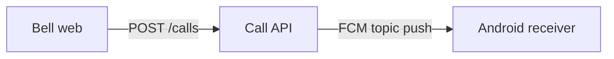

# Architecture

> 🚧 Coming soon. This page will show the end-to-end call path as a diagram
> (reusing the PRD-v3 Mermaid sequence diagram), describe the three
> deployables plus the shared package, and walk through how a call travels
> bell → API → FCM → receiver.
>
> Source material: `docs/PRD-v3.md` §2 (sequence diagram, monorepo layout),
> `apps/api/src/app.ts`.

A quick check that Mermaid rendering is wired up:

