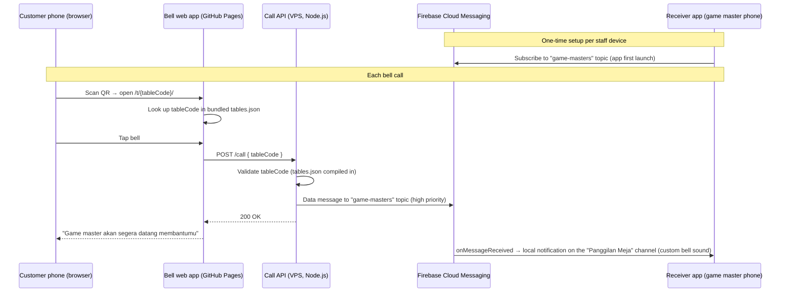

# Architecture

Game Master Bell is three deployables and one shared package, all in a
single pnpm workspace. There is no database and no server-side state for
receivers — the system's job is to move one event (a bell tap) from a
customer's browser to every staff phone as fast and as reliably as possible.

## The call path



A few things fall out of this diagram that shape the rest of the system:

- **The API stores nothing about receivers.** It doesn't know which phones
  exist or track who's subscribed — it sends one message to an FCM *topic*,
  and every subscribed device gets it. Adding or replacing a staff phone is
  a client-side subscribe, not a server-side registration.
- **The push is data-only, not a `notification` payload.** That's what
  forces `onMessageReceived` to run on the receiver in every app state —
  foreground, background, or killed — so the app can always build the
  notification itself on the custom-sound channel instead of letting the OS
  render a default one. See
  [Engineering Decisions](/engineering/engineering-decisions) for why that
  distinction mattered enough to build a native app around it.
- **The bell app never talks to FCM.** It only calls the API; FCM is purely
  a server-to-device concern. If FCM is ever swapped out, the bell app and
  its `POST /call` contract don't change.

## The three deployables + shared package

```
game-master-bell/
├── docs/                    # PRDs, RUNBOOK
├── apps/
│   ├── bell-web/            # customer bell (Vite + React, GitHub Pages)
│   ├── api/                 # call API (Fastify, VPS)
│   ├── receiver-android/    # Kotlin + Compose + FCM (staff phones)
│   └── docs/                # this site (VitePress, GitHub Pages)
├── packages/
│   └── shared/               # tables.json + types, imported by bell-web AND api
├── scripts/                 # QR generation
└── .github/workflows/       # path-filtered: pages deploy, api deploy (SSH), android CI/release
```

**`apps/bell-web`** is the only part of the system a customer ever touches —
a small React app that resolves a table code from the URL, shows the bell,
and posts a call. It's built and published to GitHub Pages; see
[Deployment](#deployment) below for how it shares that Pages site with this
docs app.

**`apps/api`** is a Fastify server on the cafe's VPS with exactly two
routes: `GET /healthz` and `POST /call`. A call validates the table code
against `tables.json` (compiled in from `packages/shared`, not fetched at
runtime — see [Engineering Decisions](/engineering/engineering-decisions)
for why the earlier HTTP-sync approach was deleted) and hands off to an
`FcmSender`:

```ts
app.post("/call", async (request, reply) => {
  const parsed = CallRequestSchema.safeParse(request.body);
  if (!parsed.success) {
    return reply.status(400).send({ error: "Invalid request body" });
  }

  const table = tablesStore.findByCode(parsed.data.tableCode);
  if (!table) {
    return reply.status(404).send({ error: "Unknown table" });
  }

  await fcmSender.sendCall(table);
  return reply.status(200).send({ ok: true });
});
```

*(trimmed of logging calls — full source in
[`apps/api/src/app.ts`](https://github.com/gatherloop/game-master-bell/blob/main/apps/api/src/app.ts).)*
`fcmSender.sendCall` builds a data-only, high-priority message addressed to
the `game-masters` topic and logs the outcome; a send failure is caught and
logged rather than thrown, so an FCM hiccup doesn't turn into a 500 for a
call that already reached the API. See
[`apps/api/src/fcm/service.ts`](https://github.com/gatherloop/game-master-bell/blob/main/apps/api/src/fcm/service.ts).

**`apps/receiver-android`** is the app every game master's phone runs. On
first launch it subscribes to the `game-masters` FCM topic; from then on
it's purely a receiver — `onMessageReceived` composes and posts a
heads-up notification on the "Panggilan Meja" channel, which owns the
custom bell sound. A Room-backed recent-calls list and permission/
subscription status live on the same status screen. There's no server
communication in the other direction — the app never calls the API, it
only receives.

**`apps/docs`** is this site — a VitePress app that shares the same GitHub
Pages deployment as `bell-web` (below) but has no runtime relationship to
the other three apps; it just documents them.

**`packages/shared`** holds `tables.json` (table code → floor/number) and
its TypeScript types. Both `bell-web` and `api` import it directly at build
time, so a table edit is one file change that both apps pick up on their
next build — no sync service, no cache, no runtime coupling between them.

## Deployment

`bell-web` and `docs` are two separate builds that get assembled into a
**single** GitHub Pages artifact — bell-web's output at the root, this
site's output under `/docs/` — because a GitHub repository only has one
Pages deployment. `api` deploys independently, over SSH, to the VPS.
`receiver-android` isn't deployed anywhere continuously; CI builds and
lints it, and tagged commits produce a signed APK published as a GitHub
Release for staff to sideload. See
[Getting Started](/engineering/getting-started) for how to build and run
each app locally, and [Repository Map](/reference/repository-map) for the
full directory layout.
