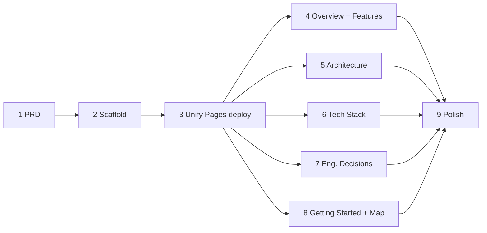

# PRD — Project Documentation Site (GitHub Pages)

**Product:** Public documentation site for **Game Master Bell** (Gatherloop
Board Game Cafe)
**Status:** Draft v1
**Last updated:** 2026-07-22
**Deploy target:** https://gatherloop.github.io/game-master-bell/docs/

---

## 1. Overview

The product PRDs (`PRD.md`, `PRD-v2.md`, `PRD-v3.md`) and `RUNBOOK.md` are
excellent *internal* engineering artifacts, but they assume the reader already
knows what Game Master Bell is, and they are written as a change history rather
than an introduction. There is no single place that answers, for an outside
reader:

- **A new engineer joining the project:** what is the stack, how is it
  structured, how do I run it, and why is it built this way?
- **A recruiter / hiring manager:** what did the author actually design and
  build, and what engineering judgement does it demonstrate?
- **A curious user / cafe operator:** what is this product, why does it exist,
  and what can it do?

This PRD specifies a **static documentation website**, published to GitHub
Pages alongside the existing bell web app, that serves all three audiences from
one navigable site with a sidebar. It reuses the content already written in the
PRDs and RUNBOOK — reorganized and rewritten for an outside reader — rather
than inventing new material.

### Goals

- **One site, three audiences.** A clear information architecture where each
  audience can find its track quickly (Product overview / Architecture & tech
  stack / Getting started).
- **Explain the *why*, not just the *what*.** The product's most interesting
  engineering decisions (native receiver for a custom sound, self-hosted API
  over Firebase, monorepo consolidation, advisory geofence) are surfaced as
  narrative, because that judgement is what recruiters and new engineers care
  about.
- **Low-maintenance and consistent with the repo.** Markdown-first, built with
  the toolchain already in the monorepo (Node 22 + pnpm + Vite ecosystem), so
  contributing to docs is the same as contributing code.
- **Zero regression to the live bell app.** The customer-facing bell at
  `https://gatherloop.github.io/game-master-bell/` must keep working
  unchanged; the docs live under the `/docs/` sub-path of the *same* Pages
  site.
- **Incremental delivery.** Every implementation phase is a single, small,
  reviewable PR that leaves `main` green (§7).

### Non-Goals

- **Not a replacement for the PRDs or RUNBOOK.** Those stay as the internal
  source of record; the docs site links to them and paraphrases, it does not
  delete them.
- **No CMS, no backend, no auth.** The site is static HTML served by GitHub
  Pages — no server, no database, no login.
- **No versioned docs / i18n framework.** A single English (with Indonesian
  product copy quoted where relevant) version is enough for one small project.
  (The product UI is Indonesian; the docs are written for an
  engineering/recruiting audience in English.)
- **No blog, no changelog automation.** Git history and the PRDs already serve
  that role.
- **No custom domain.** The project-site URL under `gatherloop.github.io` is
  the target.

---

## 2. Audiences & Information Architecture

The site is organized so each audience has an obvious entry point in the
sidebar. One page can serve more than one audience; the mapping below is about
*primary* intent.

| Audience | Wants to know | Primary pages |
|---|---|---|
| **User / cafe operator** | What is this, why does it exist, what does it do | Home, Product Overview, Features |
| **New engineer** | Stack, architecture, how to run it, how it fits together | Architecture, Tech Stack, Getting Started |
| **Recruiter / reviewer** | What the author designed & built, and the judgement behind it | Home (hero), Engineering Decisions, Tech Stack |

### Site map (sidebar)

```
Home  (landing / hero — the 30-second pitch)
│
├─ Product
│   ├─ Overview            — what & why (the problem, the users)
│   └─ Features            — QR bell, custom-sound alert, geofence, recent calls
│
├─ Engineering
│   ├─ Architecture        — system diagram, components, the call path
│   ├─ Tech Stack          — every technology + why it was chosen
│   ├─ Engineering Decisions — the interesting trade-offs (the "what I built" track)
│   └─ Getting Started     — clone, install, run each app, test, deploy
│
└─ Reference
    ├─ Repository Map      — monorepo layout, where things live
    └─ Links               — live bell app, PRDs, RUNBOOK, source
```

### Content ↔ source mapping

Nearly all content is a rewrite of material that already exists, so the docs
stay accurate and cheap to write:

| Docs page | Sourced from |
|---|---|
| Product Overview | `README.md`, PRD §1 (Overview / Goals of each version) |
| Features | PRD-v3 §4 (FR-W10 geofence, FR-N* receiver), bell-web copy |
| Architecture | PRD-v3 §2 (Mermaid sequence diagram, monorepo layout), `apps/api/src/app.ts` |
| Tech Stack | `package.json`s, `libs.versions.toml`, PRD "Rationale" columns |
| Engineering Decisions | PRD-v2/v3 "Why" sections (no-Firebase, custom sound, monorepo, geofence) |
| Getting Started | `README.md`, `RUNBOOK.md`, per-app `package.json` scripts |
| Repository Map | `pnpm-workspace.yaml`, PRD-v3 §2 "Monorepo layout" |

---

## 3. Tooling Choice

**Chosen: [VitePress](https://vitepress.dev/)** (static-site generator,
markdown-first, Vite-powered).

| Option | Verdict |
|---|---|
| **VitePress** | **Chosen.** Markdown-first (the content is already markdown in the PRDs); built-in sidebar/nav, local search, and dark mode with near-zero config; native Mermaid support (the PRDs' diagrams paste straight in); `base` option handles the `/game-master-bell/docs/` sub-path cleanly; runs on the exact toolchain already in the repo (Node 22 + pnpm workspace + Vite 8). It is Vue-based, but a docs site writes no app code, so that is immaterial. |
| Docusaurus | Capable, but React + heavier config than needed, and pulls in a second, larger toolchain than the repo already uses. Overkill for ~8 pages. |
| MkDocs (Material) | Excellent docs UX, but introduces a **Python** toolchain into an all-TypeScript monorepo — a new thing for every contributor and every CI job to manage. Rejected for consistency. |
| Hand-rolled HTML/CSS | Maximum control, but we'd rebuild sidebar, routing, search, and dark mode by hand and own them forever. Not worth it. |

The docs app lives at **`apps/docs`** as a pnpm workspace package (sibling to
`apps/bell-web` and `apps/api`), so `pnpm --filter` and the workspace scripts
work exactly as they do for the other apps.

---

## 4. Deployment — the central constraint

> **A GitHub repository has exactly one GitHub Pages deployment.** The
> `bell-web` app currently occupies that entire site: it builds to `dist/` and
> is published to `https://gatherloop.github.io/game-master-bell/` by
> `.github/workflows/deploy-bell-web.yml`. We cannot simply add a second Pages
> workflow for the docs — the two would fight over the `github-pages`
> environment and the last deploy to run would wipe the other.

Therefore the docs must be **merged into the same Pages artifact** as the bell
app, under the `/docs/` sub-path:

```
Published Pages site (one artifact)
/game-master-bell/
├── index.html            ← bell-web (customer app, unchanged URL)
├── t/{tableCode}/…       ← bell-web generated table pages
├── 404.html              ← bell-web SPA fallback (root only)
└── docs/                 ← VitePress output  ← NEW
    ├── index.html
    ├── product/overview.html
    └── …
```

### Approach: one unified Pages workflow

Replace `deploy-bell-web.yml` with a single **`deploy-pages.yml`** that:

1. Builds `bell-web` → its normal `dist/` (base `/game-master-bell/`,
   unchanged).
2. Builds `docs` with base `/game-master-bell/docs/` → its own output.
3. **Assembles** one publish directory: bell-web `dist/` at the root, with the
   VitePress output copied into `dist/docs/`.
4. Uploads that single directory as the Pages artifact and deploys it.

Path filters expand to trigger on **either** app (or shared):

```yaml
paths:
  - "apps/bell-web/**"
  - "apps/docs/**"        # NEW
  - "packages/shared/**"
  - "pnpm-lock.yaml"
  - ".github/workflows/deploy-pages.yml"
```

### Deployment notes / risks

- **404 fallback.** The bell app writes a root `404.html` that re-serves the
  SPA shell for unknown paths. `/docs/*` are *real* static files, so Pages
  serves them directly and never reaches the fallback — no conflict. VitePress
  can also emit its own `docs/404.html`; the root one is unaffected.
- **The bell app's URL and behavior do not change.** Only the deploy workflow
  is restructured; `bell-web`'s Vite `base` stays `/game-master-bell/`.
- **One concurrency group.** Keep the existing `concurrency: { group: pages }`
  so bell-web and docs edits serialize onto the one environment instead of
  racing.
- **This is the one infra-risky PR.** It touches the live customer site's
  deploy, so it is isolated into its own phase (§7, Phase 3) and validated by
  confirming the bell app still loads at its unchanged URL immediately after.

---

## 5. Functional Requirements

- **FR-D1 — Sidebar navigation.** Every page renders a persistent sidebar
  reflecting the site map in §2, so any audience can reach its track in one
  click.
- **FR-D2 — Landing page (hero).** The home page states, above the fold, what
  Game Master Bell is in one or two sentences and links to the three audience
  tracks (Product / Architecture / Getting Started).
- **FR-D3 — Product overview for non-engineers.** A page explaining the problem
  (summoning a game master on a busy cafe floor), why it exists, and the user
  flow (scan QR → tap bell → staff phone rings), in plain language with no
  required code knowledge.
- **FR-D4 — Feature list.** The customer- and staff-facing features:
  QR-per-table bell, distinctive custom-sound alert that survives a killed app,
  advisory in-cafe geofence, per-device recent-calls list, Indonesian UI.
- **FR-D5 — Architecture page.** The end-to-end call path as a diagram (reuse
  the PRD-v3 Mermaid sequence diagram), the three deployables + shared package,
  and how a call travels bell → API → FCM → receiver.
- **FR-D6 — Tech stack page.** A per-component technology table (language,
  framework, key libraries, deploy target) with a one-line rationale each,
  drawn from the PRD "Rationale" columns.
- **FR-D7 — Engineering-decisions page.** Narrative of the notable trade-offs:
  self-hosted API vs. Firebase, native Android receiver for a custom
  notification sound, monorepo consolidation, stateless FCM topic fan-out, and
  the fail-open geofence. This is the "what I built and why" track.
- **FR-D8 — Getting-started page.** Copy-pasteable steps to clone, `pnpm
  install`, and run/build/test each app, plus where deploys go — sourced from
  `README.md` and `RUNBOOK.md`.
- **FR-D9 — Repository map + links.** The monorepo layout and outbound links to
  the live bell app, the source repo, and the in-repo PRDs/RUNBOOK.
- **FR-D10 — Diagrams render.** Mermaid diagrams from the PRDs render natively
  in the published site.
- **FR-D11 — Search.** Built-in local (client-side) search across all pages;
  no external search service.

---

## 6. Non-Functional Requirements

- **NFR-D1 Cost** — Free. GitHub Pages hosting only; no new services, no
  billing.
- **NFR-D2 Zero regression** — The bell app keeps serving unchanged at
  `https://gatherloop.github.io/game-master-bell/` throughout and after the
  docs rollout (§4).
- **NFR-D3 Responsive & accessible** — The site reads well on a phone (a
  recruiter may open it on mobile) and respects light/dark preference; VitePress
  defaults satisfy this.
- **NFR-D4 Build hygiene** — Docs build in CI on the same Node 22 + pnpm
  toolchain; a broken docs build fails the workflow before publish. Path
  filters ensure a docs-only edit does not rebuild/redeploy the API, and an
  API-only edit does not touch Pages.
- **NFR-D5 Maintainability** — Content is plain markdown under `apps/docs`;
  updating a page is a one-file PR. No generated content to keep in sync by
  hand beyond the intentional PRD → docs paraphrase.
- **NFR-D6 Accuracy** — Technical claims on the site trace back to a source in
  the repo (§2 mapping); the site must not state anything the code/PRDs
  contradict.

---

## 7. Implementation Phases

One numbered track. Every phase is a **single, small, reviewable PR** that
leaves `main` green. The bell app keeps serving unchanged at every step; the
docs go live at Phase 3 and are enriched by pure-content PRs thereafter.

| # | PR | Scope | Demoable outcome |
|---|---|---|---|
| **1** | Adopt this PRD | This document (`docs/PRD-docs-site.md`); README pointer to it. No site yet. | Agreed plan on `main`. |
| **2** | Scaffold the docs app | Add `apps/docs` VitePress workspace package: config (title, `base: /game-master-bell/docs/`, sidebar skeleton from §2, Mermaid + local search enabled), a Home page with the hero (FR-D2), and stub pages for each sidebar entry. `pnpm --filter @game-master-bell/docs build` succeeds. **Not deployed yet.** | `docs:dev` serves a navigable site locally with sidebar + hero; CI builds it. |
| **3** | Unify the Pages deploy | Replace `deploy-bell-web.yml` with `deploy-pages.yml`: build bell-web (root) **and** docs, assemble one artifact with docs under `/docs/`, expand path filters (§4). | **Docs live** at `…/game-master-bell/docs/`; the bell app still loads unchanged at `…/game-master-bell/`. |
| **4** | Product Overview + Features | Write the Product → Overview (FR-D3) and Features (FR-D4) pages from `README.md` + PRD-v3 §4. | A non-engineer can read what the product is, why, and what it does. |
| **5** | Architecture page | Write Engineering → Architecture (FR-D5, FR-D10): reuse the PRD-v3 sequence diagram, describe the three deployables + shared package and the call path. | A new engineer sees the full system on one page, diagram included. |
| **6** | Tech Stack page | Write Engineering → Tech Stack (FR-D6): per-component technology table with rationale, from the `package.json`s / `libs.versions.toml` / PRD rationale columns. | Every technology in the project is listed with the reason it was chosen. |
| **7** | Engineering Decisions page | Write Engineering → Engineering Decisions (FR-D7): the no-Firebase-infra choice, native receiver for the custom sound, monorepo consolidation, stateless topic fan-out, fail-open geofence — as narrative. | The "what I built and the judgement behind it" recruiter track reads end-to-end. |
| **8** | Getting Started + Repository Map + Links | Write Getting Started (FR-D8), Repository Map, and Links (FR-D9) from `README.md` / `RUNBOOK.md` / `pnpm-workspace.yaml`. | Someone can clone and run every app following only the site. |
| **9** | Polish pass | Landing hero refinement, sidebar ordering, page metadata/social-card title, dark-mode check, cross-links; README + `RUNBOOK.md` link to the site; verify all internal links and diagrams. | A coherent, complete site ready to share with a recruiter. |

### Ordering & parallelism



- Phases **1 → 2 → 3** are strictly sequential (each needs the previous).
- After Phase 3 the site is live with stub pages; the **content phases (4–8)
  are independent** and can land in any order / in parallel — each just fills
  in one already-linked stub, so `main` stays green and the site only gets
  richer.
- Phase 9 (polish) goes last, after the content exists.

**Rollback:** Phases 2 and 4–9 are additive and trivially revertible (they only
add/edit files under `apps/docs`). Phase 3 is the only one touching the live
deploy — if the bell app fails to load after it, revert that single PR to
restore `deploy-bell-web.yml` and the previous artifact; nothing else depends on
it having landed.

---

## 8. Open Questions

1. **Home hero framing.** Should the landing page lead with the *product*
   ("summon a game master with a tap") or the *engineering story* ("a native
   push pipeline for a board-game cafe")? A single hero has to pick a primary
   voice; the audience split (§2) suggests product-first with a prominent
   "For engineers →" link. Assumed: product-first. Decide in Phase 2.
2. **Depth of the Engineering Decisions page.** How much of the PRD's reasoning
   to reproduce vs. link? Assumed: a tight narrative per decision (2–4
   paragraphs) that links to the relevant PRD section for the full argument.
   Decide in Phase 7.
3. **Screenshots / visuals.** Include screenshots of the bell app and the
   Android receiver's status screen, and a photo of a printed table QR? They
   would help all three audiences but need capturing and committing. Assumed:
   add in the Phase 9 polish pass if readily available; text + diagrams ship
   first.
4. **Show the code, or just describe it?** Whether to embed short real code
   excerpts (e.g. the ~10-line FCM send, the geofence check) on the
   Engineering pages. Assumed: yes, small excerpts with a link to the file —
   they are concrete evidence for the recruiter audience. Confirm in Phase 7.
