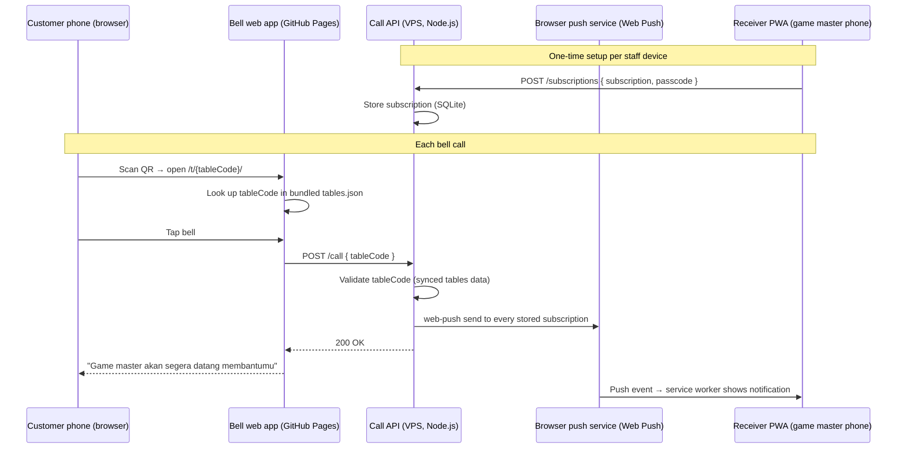
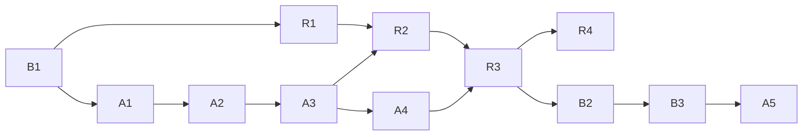

# PRD v2 — Game Master Bell: Self-Hosted Refactor

**Product:** Game Master Bell for Gatherloop Board Game Cafe
**Status:** v2.0 — **superseded by `PRD-v3.md` for the receiver and push delivery** (native Android app + FCM replace the PWA + Web Push; the self-hosted API and bell web app described here are kept). Supersedes `PRD.md` v1.3 for architecture; product behavior is unchanged.
**Last updated:** 2026-07-17

---

## 1. Overview

v1 shipped the full customer flow (QR → bell web app → push to game masters)
on a Firebase-centric stack: a Cloud Function held the FCM credentials and a
native Android app received the pushes. This refactor keeps the **product
behavior identical** — same customer flow, same notification content, same
Indonesian copy — while replacing the delivery infrastructure:

| Concern | v1 | v2 (this PRD) |
|---|---|---|
| Call endpoint | Firebase Cloud Function (`POST /call`) | **Self-hosted API on our VPS** (`POST /call`) |
| Push delivery | FCM topic `game-masters` | **Standard Web Push (VAPID)** — no Google account involved |
| Receiver | Native Android app (Kotlin/Compose) | **PWA** installed on game master phones |
| Repos | Single monorepo | **Three repos**: bell app (this one), API, receiver PWA |
| Firebase | Required (Blaze plan) | **Not used at all** — project decommissioned |

### Why refactor

- **Own the backend.** We already run a VPS; a small API there removes the
  Firebase dependency (Blaze billing account, `firebase deploy` tooling,
  Google credentials management) entirely.
- **One codebase fewer to maintain.** The receiver becomes a small web app
  instead of a native Android project — no Gradle, no Play Store / sideload
  APK distribution, updates ship by redeploying a static site.
- **Independent lifecycles.** The customer bell, the API, and the staff
  receiver change at different speeds and deploy to different targets;
  separate repos give each its own CI, release cadence, and access control.

### Goals

- Zero regression in the customer experience: same URLs, same QR stickers,
  same bell interaction, same confirmation/cooldown/error behavior.
- End-to-end latency (bell tap → notification on a game master phone)
  stays under ~5 seconds (v1 NFR-1).
- No Firebase or other third-party push broker; the only external dependency
  is the browser vendors' Web Push services (implicit in the Push API
  standard).
- Zero-downtime migration: the old Firebase path keeps working until the new
  path is verified end-to-end, then a one-line config switch cuts over.

### Non-Goals (v2)

- No new product features (no acknowledge action, no on/off duty, no
  customer-facing call status). Same scope as v1.
- No iOS-first support. Staff phones are Android (v1 assumption holds);
  Web Push on Android Chrome is fully supported. iOS works only as an
  installed home-screen PWA on iOS 16.4+ — documented, not targeted.
- No multi-cafe / multi-tenant support.

---

## 2. Target Architecture



Key structural difference from v1: FCM topics gave us free fan-out with no
state. Standard Web Push has no topic concept — each device's
`PushSubscription` is unique, so **the API stores subscriptions and loops
over them on each call**. At a handful of staff devices this is a tiny
SQLite table, but it is the one piece of persistent state v1 didn't have.

### Repository split

| Repo | Contents | Hosting / deploy |
|---|---|---|
| `gatherloop/game-master-bell` (this repo) | Bell web app (`apps/bell-web`), `packages/shared` (tables.json + types), QR script, docs | GitHub Pages via Actions (unchanged) |
| `gatherloop/game-master-bell-api` (new) | Call API: `POST /call`, subscription management, Web Push sending | VPS (Docker Compose behind a TLS reverse proxy) |
| `gatherloop/game-master-bell-receiver` (new) | Receiver PWA: service worker, subscribe flow, notification display, recent-calls list | GitHub Pages via Actions |

What leaves this repo: `functions/` (Cloud Function), `apps/receiver-android/`
(native app), `firebase.json`, and the `firebase-tools` dependency.

---

## 3. Components

### 3.1 Bell web app (this repo) — minimal changes

Everything about the bell app survives as-is: Vite + React + TS + PixiJS,
per-table static page generation from `tables.json`, GitHub Pages deploy,
Indonesian copy, 60s cooldown. The only change is the call target:

- `VITE_NOTIFY_FUNCTION_URL` is renamed to **`VITE_CALL_API_URL`** and points
  at the VPS API (e.g. `https://bell-api.gatherloop.id/call`).
- Request/response contract is unchanged (`POST { tableCode }` → 2xx / 400 /
  404), so no logic changes beyond the env var rename.

### 3.2 Call API (new repo) — suggestion

| Concern | Choice | Rationale |
|---|---|---|
| Runtime | **Node.js 22 + TypeScript + Fastify** | The v1 handler, validation, and tests (`functions/src/handler.ts`, `message.ts`) are TypeScript and port almost verbatim; shared types stay one language. Go was considered and is viable, but porting beats rewriting. |
| Push | **`web-push` npm package** (VAPID) | Reference implementation of Web Push encryption/signing; no vendor account. |
| Subscription storage | **SQLite** (`better-sqlite3`), single file on a mounted volume | Handful of rows, zero ops. A JSON file was rejected (no safe concurrent writes); Postgres is overkill. |
| Table data | **Synced from this repo's `tables.json`** (see below) | Single source of truth stays in the bell repo, which drives QR codes and static pages. |
| Deploy | **Docker Compose on the VPS**, behind Caddy/nginx with Let's Encrypt TLS | Web Push and the Pages-hosted caller both require HTTPS. |
| Observability | Structured request logs (pino) to stdout → journald/docker logs | Same "logs are enough" stance as v1 (FR-F3). |

**Table data sync:** the API fetches `tables.json` from this repo's raw
GitHub URL at startup, caches it on disk, and refreshes hourly. If a refresh
fails it keeps the last good copy; it refuses to start only if it has never
successfully loaded any copy. Alternatives rejected: publishing
`@game-master-bell/shared` as an npm package (release overhead for one JSON
file) and a duplicated copy in the API repo (silent drift).

**Endpoints:**

| Endpoint | Auth | Purpose |
|---|---|---|
| `POST /call` `{ tableCode }` | None (public, same as v1 — physical QR access is the gate; client cooldown limits spam) | Validate code → fan-out push. 400 malformed, 404 unknown/inactive code. |
| `POST /subscriptions` `{ subscription, passcode }` | **Staff passcode** (shared secret, env var) | Store a device's PushSubscription. 401 on bad passcode. |
| `DELETE /subscriptions` `{ endpoint }` | Staff passcode | Explicit unsubscribe from the PWA. |
| `GET /healthz` | None | Liveness + tables-data freshness for monitoring. |

The passcode is new relative to v1 — the Android app's install ceremony was
the implicit gate on who could receive calls; a public PWA URL needs an
explicit one. A single shared passcode rotated occasionally is enough at
this trust level.

**Push payload** (parity with v1 FR-F2): title `"Panggilan Game Master"`,
body `"Meja {number} · Lantai {floor} memanggil game master"`, data fields
`tableCode`, `floor`, `number`, `calledAt`.

**Dead subscription pruning:** a push send returning `404`/`410` means the
subscription is expired — the API deletes that row on the spot, so the store
is self-cleaning.

### 3.3 Receiver PWA (new repo) — suggestion

| Concern | Choice | Rationale |
|---|---|---|
| Stack | **Vite + TypeScript** (vanilla or Preact), web app manifest, hand-written service worker | The app is one screen + a push handler; a framework is optional. |
| Hosting | **GitHub Pages** via Actions | Free HTTPS (required for service workers/Push API), same deploy model as the bell app. |
| Subscribe flow | On first launch: notification permission → enter staff passcode → `pushManager.subscribe({ applicationServerKey: VAPID_PUBLIC_KEY })` → `POST /subscriptions` | Mirrors v1 FR-D1. |
| Notification | Service worker `push` event → `showNotification` with table/floor, sound/vibration pattern; `notificationclick` focuses the app | Mirrors v1 FR-D2/D4 as far as the web platform allows (see NFR note on channels). |
| Recent calls | Persist received calls in **IndexedDB**, render list on the status screen | Mirrors v1 FR-D3 (was Room on Android). |
| Install | "Add to Home Screen" on Android Chrome (install prompt) | Replaces APK sideloading; updates are just redeploys. |

---

## 4. Functional Requirements

Requirements carried over unchanged from v1 keep their meaning; only the
implementing component moves.

### 4.1 Bell web app (this repo)

- **FR-W1…W9** — unchanged from v1 (`PRD.md` §5.1), except FR-W4 now reads:
  tapping the bell sends `POST /call` with `{ "tableCode": "2-05" }` to the
  **call API** (URL from `VITE_CALL_API_URL`).

### 4.2 Call API (api repo)

- **FR-A1** — `POST /call` accepts `{ "tableCode": string }`, validates it
  against the synced tables data (404 unknown/inactive, 400 malformed).
  *(v1 FR-F1.)*
- **FR-A2** — On a valid call, sends one Web Push message to **every stored
  subscription** with the payload defined in §3.2. Sends run concurrently;
  one dead device must not delay or fail the others. *(v1 FR-F2.)*
- **FR-A3** — Logs each call (table code, outcome, per-subscription send
  result) as structured logs. *(v1 FR-F3.)*
- **FR-A4** — CORS allows the GitHub Pages origin(s) — bell app and receiver
  PWA — plus localhost for development. *(v1 FR-F4.)*
- **FR-A5** — `POST /subscriptions` stores a `PushSubscription` keyed by its
  endpoint (idempotent upsert), gated by the staff passcode; `DELETE
  /subscriptions` removes one. Invalid passcode → 401.
- **FR-A6** — Subscriptions whose push send returns 404/410 are deleted
  automatically.
- **FR-A7** — The API serves its VAPID **public** key at `GET /vapid-key` so
  the receiver never hardcodes it. The private key lives only in the API's
  environment.

### 4.3 Receiver PWA (receiver repo)

- **FR-R1** — On first launch the app requests notification permission,
  asks for the staff passcode, subscribes via the Push API, and registers
  the subscription with the call API. *(v1 FR-D1.)*
- **FR-R2** — Incoming pushes display a notification with table and floor,
  with sound and vibration, whether the PWA is foreground, background, or
  closed (service worker handles the `push` event). *(v1 FR-D2.)*
- **FR-R3** — The status screen shows subscription state (subscribed / not
  subscribed / permission denied) and a list of recent calls received on
  this device. *(v1 FR-D3.)*
- **FR-R4** — An explicit "berhenti berlangganan" (unsubscribe) action
  unsubscribes locally and calls `DELETE /subscriptions`.
- **FR-R5** — UI copy is in Indonesian, matching the bell app's tone.

---

## 5. Non-Functional Requirements

- **NFR-1 Latency** — unchanged: tap → notification under ~5s. (No cold
  starts anymore — the VPS process is always warm — but browser push
  services add their own variable delivery delay; Android Chrome is
  typically sub-second.)
- **NFR-2 Availability** — the API is now on our VPS, so uptime is our
  responsibility: process supervision via Docker `restart: always`, TLS
  auto-renewal, and a `GET /healthz` check wired to simple uptime
  monitoring. The bell app must keep failing gracefully when the API is
  down (v1 behavior).
- **NFR-3 Security** — VAPID private key and staff passcode live only in the
  API's environment. `POST /call` stays public with client-side cooldown
  (v1 stance); subscription endpoints are passcode-gated. HTTPS everywhere
  (hard requirement of the Push API).
- **NFR-4 Cost** — GitHub Pages free ×2; the API rides on the existing VPS;
  Web Push is free. The Firebase Blaze billing account is closed at the end
  of the migration.
- **NFR-5 Maintainability** — three repos, each with its own CI (lint,
  typecheck, tests). The API ports the existing handler tests; the receiver
  gets at least a service-worker payload-handling test.
- **NFR-6 Platform note** — Android Chrome (staff standard) fully supports
  Web Push. Notification sound/vibration control is coarser on the web than
  Android channels gave us (v1 FR-D4); the notification uses the default
  sound + a vibration pattern, and finer control is per-site browser
  settings. iOS support exists only as an installed PWA on iOS 16.4+ and is
  explicitly not a target.

---

## 6. Data Model

Two persistent datasets — one more than v1:

**`tables.json`** — unchanged, stays in `packages/shared` in this repo
(source of truth for QR codes, static pages, and API validation via sync).

**`subscriptions` (SQLite, api repo)**

```sql
CREATE TABLE subscriptions (
  endpoint    TEXT PRIMARY KEY,   -- PushSubscription.endpoint (unique per device+browser)
  p256dh      TEXT NOT NULL,      -- encryption public key from the subscription
  auth        TEXT NOT NULL,      -- auth secret from the subscription
  created_at  TEXT NOT NULL       -- ISO timestamp, for manual housekeeping
);
```

No call history is persisted server-side (unchanged from v1); the receiver
keeps its own per-device recent-calls list in IndexedDB.

---

## 7. Implementation Phases

Each repo has its own phase track — **A** (API), **R** (receiver PWA),
**B** (bell, this repo) — since each repo has its own CI, reviewers, and
release cadence. Every phase is a **single, small, reviewable PR** that
leaves its repo green and demoable. The production system keeps running on
the v1 Firebase path until B2 flips the switch, so there is no downtime
window.

### API repo (`game-master-bell-api`)

| # | PR | Scope | Demoable outcome |
|---|---|---|---|
| **A1** | API scaffold & CI | Node 22 + TS + Fastify skeleton, `GET /healthz`, lint/typecheck/test CI, Dockerfile + Compose file, VPS deploy doc (TLS via reverse proxy). | `https://<api-host>/healthz` returns 200 from the VPS. |
| **A2** | Table sync + `POST /call` (validation only) | Port `handler.ts` validation + tests from the bell repo's `functions/`; tables.json fetch-at-startup with disk cache and hourly refresh; push send stubbed as a log line. | `curl /call` → 200 for a real code, 404 unknown, 400 malformed. |
| **A3** | Subscription store + endpoints | SQLite via `better-sqlite3`, `POST`/`DELETE /subscriptions` with passcode gate, `GET /vapid-key`, VAPID keygen script + env wiring. | A subscription posted with `curl` lands in the DB; wrong passcode → 401. |
| **A4** | Web Push fan-out | Wire `/call` to `web-push` sends across all stored subscriptions (concurrent, per-send logging), 404/410 auto-prune. | Bell-less test: `curl /call` rings a real browser subscribed by hand via devtools. |
| **A5** | Decommission & runbook | Ops PR: document Firebase project deletion + billing closure, uptime monitoring for `/healthz`, passcode rotation procedure. | Firebase console empty; monitoring live. |

### Receiver repo (`game-master-bell-receiver`)

| # | PR | Scope | Demoable outcome |
|---|---|---|---|
| **R1** | PWA scaffold & deploy | Vite + TS app shell, manifest + icons, empty service worker, GitHub Pages deploy workflow, CI. | Installable PWA live on its Pages URL. |
| **R2** | Subscribe flow | Permission prompt → passcode input → `pushManager.subscribe` (key from `GET /vapid-key`) → register with API; status screen shows subscription state; unsubscribe action (FR-R1, FR-R4). | Status screen shows "subscribed" on a real phone; row visible in API DB. |
| **R3** | Notification handling | Service worker `push` → notification with table/floor + vibration, `notificationclick` focus (FR-R2). | Bell tap (or `curl /call`) rings the phone with correct table/floor — new path works end to end. |
| **R4** | Recent-calls list | Persist pushes to IndexedDB, render recent-calls list on the status screen (FR-R3). | Game master reviews recent calls on the device. |

### Bell repo (this repo, `game-master-bell`)

| # | PR | Scope | Demoable outcome |
|---|---|---|---|
| **B1** | Adopt PRD v2 | This document; mark v1 PRD superseded for architecture. | Agreed plan on `main`. |
| **B2** | Cut over the bell | Rename env var to `VITE_CALL_API_URL`, point the Pages workflow's variable at the VPS API, update RUNBOOK. | Production customer flow runs entirely on the new stack; Firebase path idle. |
| **B3** | Remove Firebase & Android | Delete `functions/`, `apps/receiver-android/`, `firebase.json`, `firebase-tools` dep; prune workspace config, CI (drop the Gradle job), README/RUNBOOK. | Slim bell-only repo, CI green. |

### Cross-repo ordering

Within each track, phases are sequential. Across tracks, only these
dependencies exist:



- **R2 needs A3** (subscription endpoints must exist) and **R3 needs A4**
  (fan-out must send real pushes) — otherwise the API track (A1→A4) and the
  receiver track (R1→R4) proceed in parallel.
- **B2 waits for R3** verified end-to-end on every staff device; **B3**
  (delete old code) follows the cutover, and **A5** (Firebase
  decommission) comes last, once nothing references the old path.

**Rollback:** until B3 merges, rolling back is a one-variable change —
point `VITE_CALL_API_URL`/`VITE_NOTIFY_FUNCTION_URL` back at the
still-deployed Cloud Function and redeploy Pages. Staff keep the Android
app installed until R3 is verified on every staff device.

---

## 8. Open Questions

1. **API domain** — which hostname on the VPS (e.g. `bell-api.gatherloop.id`)?
   Needed before A1's deploy step; CORS and the Pages variable depend
   on it.
2. **Staff passcode UX** — type once and store in the PWA (localStorage) vs.
   re-enter on resubscribe? Assumed: store locally after first entry.
3. **Receiver repo hosting** — GitHub Pages assumed; serving the PWA from
   the VPS behind the same domain as the API is a fine alternative if a
   single origin is preferred (simplifies CORS).
4. Carried over from v1: acknowledge action and on/off-duty state remain
   deferred; if they land later, the API's SQLite store is a natural home
   for that state.
