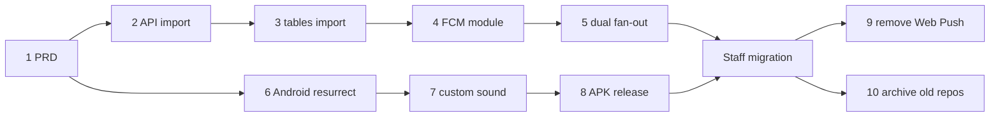

# PRD v3 — Game Master Bell: Native Android Receiver, Back to a Monorepo

**Product:** Game Master Bell for Gatherloop Board Game Cafe
**Status:** Draft v3.1 (supersedes `PRD-v2.md` for the receiver, push
delivery, and repository layout; the self-hosted API and bell web app of v2
are kept)
**Last updated:** 2026-07-17

---

## 1. Overview

v2 replaced the v1 Firebase stack with a self-hosted call API on our VPS and
a receiver **PWA** using standard Web Push. The API and the bell web app have
worked well — but the PWA receiver has a defect we cannot engineer around:

> **Web Push cannot set a custom system notification sound.** A bell call
> arrives with the phone's default notification chime, indistinguishable from
> a chat message or an app promo. On a busy cafe floor, game masters tune it
> out — the one thing the product must not allow.

The web platform offers no fix: the Notifications API `sound` option is
unimplemented in every browser, a service worker cannot play audio while the
app is closed, and per-site notification channels on Android Chrome still
don't expose custom sounds. v1's native app got this right structurally — an
Android **notification channel** owns its sound — it just shipped with the
default chime.

**v3 therefore brings back the native Android receiver app** (resurrected
from the v1 code in this repo's git history) with a distinctive custom bell
sound, and **consolidates everything back into this monorepo**:

| Concern | v2 (current) | v3 (this PRD) |
|---|---|---|
| Bell web app | GitHub Pages, `POST /call` | **Unchanged** (already in this repo) |
| Call endpoint | Self-hosted Node.js API on our VPS, own repo | **Same API, same VPS** — code moves to `apps/api` in this repo |
| Push delivery | Web Push (VAPID), subscriptions in SQLite | **FCM topic send** from the same API |
| Receiver | PWA (`game-master-bell-receiver` repo) | **Native Android app** at `apps/receiver-android` in this repo |
| Notification sound | Browser/system default | **Custom bell sound** via a notification channel |
| Server state | `subscriptions` table + staff passcode | **None** — topic fan-out is stateless |
| Repos | Three (`game-master-bell`, `-api`, `-receiver`) | **One monorepo** (this repo); the other two archived after migration |
| Table data flow | API fetches `tables.json` over HTTP hourly, disk cache | **Direct workspace import** — sync module deleted |

### Do we need FCM? — Yes. Here's why.

Going native reopens the question v2 closed: how do pushes reach the phone?
The options for a native Android app:

| Option | Verdict |
|---|---|
| **FCM (data messages, topic fan-out)** | **Chosen.** The only delivery channel with OS-level privileges: Google Play services maintains the single persistent socket every Android phone already has, and high-priority FCM messages wake the app from Doze and killed state. Free, unlimited at any realistic scale, no billing account. |
| Keep Web Push | Not possible. Web Push endpoints are browser-bound; a native app cannot subscribe to them. (On Android, Chrome's Web Push is itself delivered over FCM — the native app just uses that transport directly.) |
| UnifiedPush / self-hosted ntfy | No Google dependency, but delivery rides on a userspace persistent connection that OEM battery managers kill. Staff phones are typical Indonesian-market devices (Xiaomi/Oppo/Vivo/Realme), the exact vendors notorious for killing background connections. A missed call is the one unacceptable failure mode. Also adds a service to run on the VPS. |
| Own WebSocket + foreground service | Same OEM process-death problem, plus a permanent ongoing notification and per-device battery-settings whack-a-mole. |

**Doesn't this contradict v2's "no Firebase" goal?** No — v2's objection was
to Firebase as *infrastructure we deploy to*: the Cloud Function, the Blaze
billing account, `firebase deploy` tooling, and credentials for a runtime we
didn't own. None of that returns:

- FCM alone runs on the free **Spark plan** — no billing account, nothing to
  decommission-proof.
- No Google-hosted code. The send is ~10 lines of `firebase-admin` inside
  our existing Node API on the VPS, authenticated by a service-account JSON
  in the API's environment — exactly where the VAPID private key lives today.
- The call path stays: bell → our API → push. FCM replaces only the last
  hop (the browser push services v2 already depended on implicitly). We
  trade one push broker for another, and gain custom sounds, topic fan-out
  (no subscription state), and delivery that survives Doze.

### Why undo the v2 repo split

v2 split into three repos for "independent lifecycles, CI, and access
control". In practice, for one small team, the split bought overhead
instead:

- **Cross-repo coordination.** v2's phase plan needed a dependency graph
  across repos (R2-needs-A3, etc.); every contract change is two PRs that
  must land in order. In one repo it's one atomic PR.
- **The tables sync module exists only because of the split.** The API
  fetches `tables.json` from this repo's raw GitHub URL, caches it on disk,
  and refreshes hourly — fetch, cache, refresh timer, failure handling,
  `TABLES_URL`/`TABLES_CACHE_PATH`/`TABLES_REFRESH_INTERVAL_MS` config, and
  tests for all of it. In a monorepo the API imports `packages/shared`
  directly at build time and all of that is deleted. A table edit
  propagates by triggering the API deploy workflow (minutes, atomic)
  instead of "within an hour, if the fetch succeeds".
- **Access control never mattered** — same people everywhere.
- v1 was already this monorepo (web app + function + Android side by side);
  the layout is proven here.

The cost is workflow hygiene: CI and deploy jobs get `paths:` filters so a
bell-web change doesn't rebuild the Android app or redeploy the API. That's
a few lines of YAML, paid once.

### Goals

- **A bell call sounds like a bell.** Unmistakable custom sound, heads-up
  notification, whether the app is foreground, background, or killed.
- Zero regression in the customer flow: bell web app and `POST /call`
  contract untouched; end-to-end latency stays under ~5s (NFR-1 since v1).
- Reuse over rewrite: resurrect the reviewed v1 Android app from git
  history; move the v2 API code as-is and only swap its delivery module.
- Simplify: one repo, no tables-sync module, no subscriptions table, no
  staff passcode, no VAPID key management.
- Zero-downtime migration: Web Push and FCM run side by side until every
  staff phone runs the native app; the deployed PWA and API keep working
  throughout.

### Non-Goals (v3)

- No new product features — no acknowledge action, no on/off duty, no
  customer-facing call status (deferred since v1).
- No iOS receiver. Staff phones are Android (standing assumption).
- **No Play Store.** The APK is distributed directly to staff phones
  (sideload), as in v1 — see §3.3; the custom sound does not depend on the
  distribution channel in any way.
- No multi-cafe / multi-tenant support.
- No git-history surgery: API code moves into the monorepo as plain files;
  its history stays readable in the archived `game-master-bell-api` repo.

---

## 2. Target Architecture


Structurally this restores v1's stateless fan-out: an FCM **topic** send
reaches every subscribed device in one call, so the API stores nothing about
receivers. The v2 `subscriptions` table, passcode gate, and dead-subscription
pruning all become unnecessary and are deleted at the end of the migration.

### Monorepo layout (target)

```
game-master-bell/
├── docs/                    # PRDs, RUNBOOK
├── apps/
│   ├── bell-web/            # customer bell (unchanged)
│   ├── api/                 # call API — moved from game-master-bell-api
│   └── receiver-android/    # Kotlin + Compose + FCM — resurrected from v1 history
├── packages/
│   └── shared/              # tables.json + types, imported by bell-web AND api
├── scripts/                 # QR generation
└── .github/workflows/       # path-filtered: pages deploy, api deploy (SSH), android CI/release
```

`apps/bell-web` and `apps/api` are pnpm workspace packages;
`apps/receiver-android` is a standard Gradle project alongside the workspace
(exactly as in v1). Deploy targets are unchanged: bell-web → GitHub Pages,
api → the same VPS via the same SSH deploy workflow (moved here with a
`paths:` filter on `apps/api/**` + `packages/shared/**` — the latter is how
table edits now reach production).

### Fate of the other repos

| Repo | During migration | End state |
|---|---|---|
| `game-master-bell-api` | Its `main` stays deployable as rollback until the monorepo deploy is verified; its deploy workflow is then disabled so the VPS has exactly one deploy source | **Archived** (read-only, history preserved) |
| `game-master-bell-receiver` | The PWA stays deployed and receiving Web Push from its own repo, untouched, until every staff phone runs the native app | **Archived**; its Pages site taken down |

The PWA is never imported into the monorepo — it's end-of-life; only the
native app takes its place.

### Firebase project

The v1 Firebase project was deleted in v2 Phase A5, so v3 creates a fresh
one (Spark plan, FCM only, no billing):

- **App side:** `google-services.json` in the Android project (safe to
  commit — it contains identifiers, not secrets; same stance as v1).
- **API side:** a service-account JSON (Firebase messaging scope) on the
  VPS, referenced by env var — handled exactly like the VAPID private key
  it replaces.

---

## 3. Components

### 3.1 Bell web app (`apps/bell-web`) — no changes

`VITE_CALL_API_URL`, the `POST /call` contract, copy, cooldown — all
untouched. v3 requires no changes to the bell app.

### 3.2 Call API (`apps/api`, moved into this repo)

| Concern | Choice | Rationale |
|---|---|---|
| Move | Copy the `game-master-bell-api` source into `apps/api` as a workspace package; port its CI (lint/typecheck/test) and SSH deploy workflow here with `paths:` filters | Same code, same VPS, same secrets (moved to this repo's settings). No behavior change in the move itself. |
| Table data | **Import `tables.json` from `packages/shared`** at build time; delete the sync module (`src/tables/sync.ts`, disk cache, refresh timer, `TABLES_URL`/`TABLES_CACHE_PATH`/`TABLES_REFRESH_INTERVAL_MS`) | The sync existed only to cross the repo boundary (§1). Table edits deploy the API via the workflow's `packages/shared/**` path filter. |
| FCM sending | **`firebase-admin`** (Messaging only), topic `game-masters` | Official server SDK; one dependency, one `send()` call. Raw HTTP v1 + `google-auth-library` was considered and rejected as hand-rolling what the SDK does. |
| Message type | **Data-only** message, `android.priority: "high"` | Data-only guarantees `onMessageReceived` runs in every app state, so the app always builds the notification itself on the custom-sound channel. A `notification` block would let the system render it in background/killed state and bypass the app's channel choice. High priority is required to punch through Doze — justified for a human-summoning bell. |
| Payload | `data: { tableCode, floor, number, calledAt }` (all strings — FCM data values must be strings) | Same fields as v1/v2; title/body strings live in the app (already localized there). |
| Migration | `/call` fans out to **both** Web Push and FCM until cutover completes | Each staff phone migrates independently; no downtime window. |
| End state | Delete `web-push`, SQLite store, `POST/DELETE /subscriptions`, `GET /vapid-key`, VAPID + passcode env vars | Topic fan-out is stateless; the API returns to v1's zero-persistent-receiver-state design (and with the tables cache gone too, the API needs **no data volume at all**). |
| Config | `FCM_SERVICE_ACCOUNT_PATH` (JSON on the VPS), `FCM_TOPIC` (default `game-masters`) | Same secret-handling pattern as the VAPID keys being removed. |

**Who can receive calls?** Topic subscription happens client-side with no
server gate — anyone running the APK could subscribe. v1 shipped with
exactly this stance: hand-distributed APKs on staff phones are the gate, and
the worst case (an outsider hears table calls) is low-stakes. v2's passcode
existed because a PWA on a public URL has no install ceremony; the APK
restores it, so the passcode retires with the PWA. Escalation path if this
ever changes: passcode-gated FCM *token* registration in the API, reusing
the v2 store pattern (token instead of subscription).

### 3.3 Receiver Android app (`apps/receiver-android`) — the core of v3

| Concern | Choice | Rationale |
|---|---|---|
| Language/UI | **Kotlin + Jetpack Compose** (resurrected v1 app) | Reviewed working code beats a rewrite; the app is a status screen + notifications. |
| Location | `apps/receiver-android`, restored from this repo's own history (the commit before "Phase B3: remove Firebase and Android", `077b508^`) — its original path | The resurrection is a near-verbatim restore; review focuses on the delta (new Firebase project id, version bumps). |
| Push | FCM topic `game-masters` subscription on first launch | Stateless fan-out; no registration endpoint. |
| **Custom sound** | Bell sound bundled at `res/raw/bell_call.ogg`, set on the notification channel via `setSound(...)` with `USAGE_NOTIFICATION_EVENT` audio attributes | The whole point of v3. Channel-owned sound plays in background and killed states — no app process needed at alert time. |
| Channel identity | New channel id **`table_calls_v2`** (name stays "Panggilan Meja"); v1's channel id retired | Android channels are **immutable after creation** — sound can't be changed on an existing channel. Any future sound change means another id bump (`_v3`, …); the app deletes retired ids on startup. |
| Notification | `IMPORTANCE_HIGH` heads-up, table/floor content, vibration pattern, tap-to-open; **unique notification id per call** | Unique ids make repeated calls stack and re-alert instead of silently replacing an unread one (v2's `renotify` behavior, done natively). |
| Message handling | Data-only payload → app composes title/body from `strings.xml` (Indonesian) | Matches the API's data-only sends; works identically in all app states. |
| Recent calls | Room-backed list on the status screen (from v1) | FR parity with v1 FR-D3 / v2 FR-R3. |
| Permissions & OEM reality | `POST_NOTIFICATIONS` runtime prompt (Android 13+); status screen surfaces permission/subscription state; runbook covers disabling battery optimization + OEM autostart settings per staff device | High-priority FCM mostly survives Doze, but aggressive OEM managers can still defer it; setup checklist beats debugging it later. |
| **Distribution** | **Direct APK install on staff phones — no Play Store.** CI builds a signed release APK, published as a GitHub Release on tag; installed by sideload ("install unknown apps" permission, one-time per phone) | v1's model; a handful of devices doesn't justify Play Store overhead. See the note below. |
| Min SDK | API 26 (Android 8.0) | Notification-channels baseline, as in v1. |

**Sideloading and the custom sound.** The custom sound is an ordinary app
resource registered on a notification channel — it is a property of the
installed app, not of the distribution channel, so it works identically
whether the APK arrives via Play Store, a download link, or a USB cable.
The only things sideloading changes are operational:

- **Updates are manual.** There's no auto-update; a new version means
  installing the new APK on each phone (the runbook covers this; a
  handful of devices makes it a non-issue).
- **Same signing key every release.** Android only installs an update over
  an existing app if both are signed with the same key — so the release
  keystore must be kept safe (CI secret + offline backup). Losing it means
  uninstall/reinstall (and re-doing channel settings) on every phone.
- Each phone needs the one-time "install unknown apps" permission for
  whatever app opens the APK (browser/file manager).

### 3.4 Receiver PWA — end of life

The PWA keeps working (and keeps receiving Web Push) from its own repo
throughout the migration. Once every staff phone runs the native app, the
API's Web Push path is deleted, the Pages site is taken down, and the
`game-master-bell-receiver` repo is archived.

---

## 4. Functional Requirements

Bell web app requirements (FR-W1…W9) are unchanged from v1/v2 and not
restated. API validation requirements FR-A1 (validate + 400/404), FR-A3
(structured logs), FR-A4 (CORS) carry over unchanged.

### 4.1 Call API

- **FR-A2v3** — On a valid call, the API sends one high-priority **data-only
  FCM message** to the `game-masters` topic with `data` fields `tableCode`,
  `floor`, `number`, `calledAt` (string values). During the migration phase
  it *also* performs the v2 Web Push fan-out; after cutover the Web Push
  path is removed.
- **FR-A8** — FCM send outcome (message id or error) is logged per call,
  alongside the existing call log fields.
- **FR-A9** — The API refuses to start without valid FCM credentials
  (mirroring the current VAPID startup check); after cutover the VAPID/
  passcode startup checks are removed with their features.
- **FR-A10** — The API validates table codes against `tables.json` imported
  from `packages/shared` at build time; the HTTP sync module and its
  config are removed. A `tables.json` edit reaches production by triggering
  the API deploy workflow.

### 4.2 Receiver Android app

- **FR-N1** — On first launch the app requests notification permission
  (Android 13+) and subscribes to the `game-masters` FCM topic. *(v1 FR-D1.)*
- **FR-N2** — Incoming calls display a heads-up notification with table and
  floor **playing the custom bell sound** and a vibration pattern, in
  foreground, background, and killed states.
- **FR-N3** — Repeated calls each produce a new alert (unique notification
  ids); a second call never silently replaces an unread first one.
- **FR-N4** — The notification channel ("Panggilan Meja") is user-visible so
  staff can adjust it in system settings; the channel is created with the
  custom sound, and sound changes ship as a new channel id with retired ids
  cleaned up. *(v1 FR-D4 + the immutability rule.)*
- **FR-N5** — The status screen shows notification-permission state, topic
  subscription state, and the recent calls received on this device.
  *(v1 FR-D3.)*
- **FR-N6** — Tapping the notification opens the app on the status screen.
- **FR-N7** — UI copy is in Indonesian, matching the bell app's tone.

---

## 5. Non-Functional Requirements

- **NFR-1 Latency** — unchanged: tap → audible bell under ~5s. High-priority
  FCM on Android is typically sub-second; the VPS API adds no cold starts.
- **NFR-2 Availability** — unchanged: VPS uptime is ours (`/healthz`
  monitoring stands); FCM availability is Google's. The bell app keeps
  failing gracefully if the API is down.
- **NFR-3 Security** — the FCM service-account JSON lives only in the API's
  environment (replacing the VAPID private key there). `POST /call` stays
  public with client cooldown (v1 stance). Receiver access is gated by APK
  distribution (§3.2). `google-services.json` in the repo is non-secret.
  The APK release keystore lives only in CI secrets + an offline backup.
- **NFR-4 Cost** — unchanged: Pages free, VPS already paid, FCM free (Spark
  plan, **no billing account** — the v1 Blaze requirement came from Cloud
  Functions, which are not used).
- **NFR-5 Maintainability** — one repo, one CI, with `paths:`-filtered jobs
  so each app builds/deploys only on relevant changes. The API's test suite
  stays green through the move (FCM faked in tests); the Android app gets an
  `assembleDebug` + lint job.
- **NFR-6 Sound asset** — the bell sound must be distinctive, short (~2–3s),
  and licensed for redistribution (CC0 or cafe-owned recording); the file
  and its provenance are committed to the repo.

---

## 6. Data Model

v3 **removes** all server-side persistent state:

- **`tables.json`** — unchanged, in `packages/shared`, now compiled into
  both the bell app and the API (no runtime sync, no disk cache).
- **`subscriptions` (SQLite)** — deleted with the Web Push path at the end
  of the migration. Until then it keeps serving the PWA fan-out.
- **Recent calls** — per-device Room database in the Android app (as in v1);
  no server-side call history.

---

## 7. Implementation Phases

One repo, one numbered track (as in v1). Every phase is a **single, small,
reviewable PR** that leaves `main` green and demoable. Production keeps
running on the v2 Web Push path until the staff migration completes; the
still-deployed PWA and the archived-later API repo serve as rollback at
every step.

| # | PR | Scope | Demoable outcome |
|---|---|---|---|
| **1** | Adopt PRD v3 | This document; mark PRD-v2 superseded; README pointer. | Agreed plan on `main`. |
| **2** | Import the call API | Copy `game-master-bell-api` source into `apps/api` as a workspace package (code unchanged); port CI jobs and the SSH deploy workflow with `paths:` filters (`apps/api/**`, `packages/shared/**`); move deploy secrets; verify a monorepo-triggered deploy, then disable the old repo's deploy workflow. | VPS runs a build deployed from the monorepo; old repo kept as rollback. |
| **3** | Tables via workspace import | Replace the HTTP tables sync with a direct import of `packages/shared`; delete `src/tables/sync.ts`, disk cache, refresh config + their tests; update README/RUNBOOK (table edits now deploy the API). | A `tables.json` edit lands in production via one merged PR; sync code gone. |
| **4** | FCM sender module | Add `firebase-admin`, an `fcm/` module sending a data-only high-priority topic message, env wiring (`FCM_SERVICE_ACCOUNT_PATH`, `FCM_TOPIC`) + startup check, unit tests with a faked messaging client. Not yet called from `/call`. RUNBOOK: creating the Firebase project + service account. | Tests green; a manual script send shows up in the Firebase console. |
| **5** | Dual fan-out on `/call` | Wire `/call` to send FCM alongside the existing Web Push fan-out, per-send logging (FR-A8); failure of one channel must not fail the other. | `curl /call` rings both the PWA (Web Push) and a topic-subscribed device. |
| **6** | Resurrect the Android app | Restore `apps/receiver-android` from `077b508^` (its original path), new Firebase project's `google-services.json`, Android CI job (`assembleDebug` + lint). Near-verbatim restore of reviewed v1 code — review focuses on the delta. | App installs on a staff phone; status screen shows; CI green. |
| **7** | Custom bell sound + data-only handling | Bundle the licensed sound asset; create channel `table_calls_v2` with `setSound(...)`, retire the v1 channel id; handle **data-only** messages (compose title/body in-app); unique notification id per call (FR-N3). | A call rings the phone **with the bell sound** while the app is killed. |
| **8** | APK release + rollout runbook | Signed-release workflow publishing an APK to GitHub Releases on tag (keystore in CI secrets); install runbook: sideload steps, "install unknown apps", `POST_NOTIFICATIONS`, battery-optimization + OEM autostart checklist. | Tagged release produces an installable APK; a phone set up purely from the runbook receives calls. |
| — | **Staff migration (ops, not a PR)** | One phone at a time: install the APK, verify a real bell call rings with the custom sound, unsubscribe that phone's PWA. Both delivery paths stay live throughout. | Every staff phone on the native app. |
| **9** | Remove the Web Push path | Delete `web-push`, subscriptions store + endpoints, `GET /vapid-key`, passcode + VAPID env/config and startup checks; update docs. **Gated on the staff migration.** | Slim, stateless FCM-only API; `/call` still rings every staff phone. |
| **10** | Decommission old repos | Take down the PWA Pages site; archive `game-master-bell-receiver` and `game-master-bell-api` (read-only, history preserved); final README/RUNBOOK pass. **Gated on the staff migration.** | One active repo; nothing stale deployed. |

### Ordering & parallelism



- The **API track (2→5)** and the **Android track (6→8)** are independent
  and can proceed in parallel after phase 1.
- Phase 7's end-to-end demo needs phase 5, but its work is independently
  testable with Firebase console test messages, so the tracks don't block
  each other.
- Phases 9 and 10 delete the safety net, so they go last (either order),
  only after every phone is verified on the native app.

**Rollback:** until phase 9/10, every phone can fall back to the PWA
(resubscribe from its still-deployed URL) and the API still fans out Web
Push. The API move (phase 2) keeps the old repo deployable until the
monorepo deploy is verified. After 9/10, rollback means reverting those PRs
and redeploying — which restores the dual path.

---

## 8. Open Questions

1. **The bell sound itself** — a recording of the cafe's physical bell (best
   brand fit) vs. a licensed CC0 bell sample? Needed by phase 7; NFR-6 sets
   the constraints. Assumed: CC0 sample now, replaceable later via a
   channel-id bump.
2. **Sound audibility** — is `USAGE_NOTIFICATION_EVENT` at system
   notification volume loud enough on the cafe floor, or should the channel
   use alarm-stream audio attributes (rings at alarm volume, ignores
   notification volume)? Decide during phase 7 testing on a real floor.
3. **Firebase project ownership** — which Google account owns the new
   Spark project? Should be a shared cafe account, not a personal one
   (lesson from decommissioning v1). Needed before phase 4.
4. **Release keystore custody** — who holds the offline backup of the APK
   signing keystore besides the CI secret? Losing it forces
   uninstall/reinstall on every phone (§3.3). Needed by phase 8.
5. Carried since v1: acknowledge action and on/off-duty state stay deferred.
   Note: on/off duty would fit naturally as FCM topic unsubscribe/subscribe
   — no server state needed even then.
