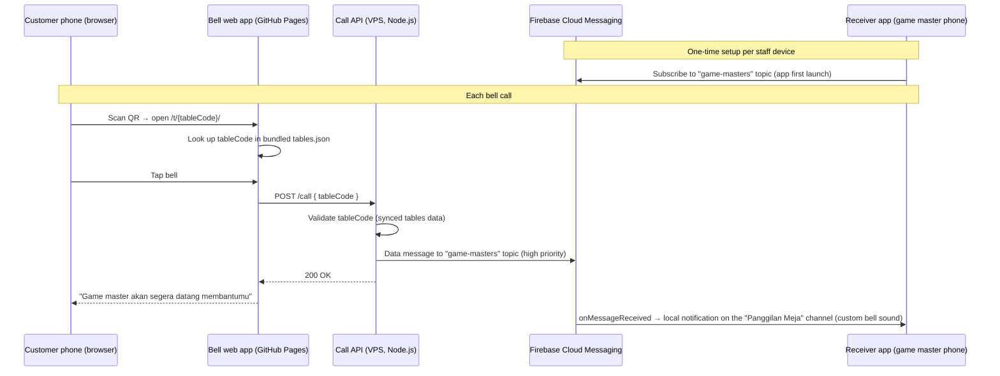
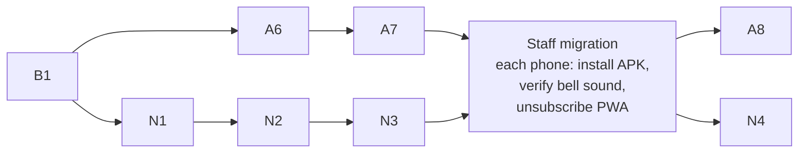

# PRD v3 — Game Master Bell: Native Android Receiver

**Product:** Game Master Bell for Gatherloop Board Game Cafe
**Status:** Draft v3.0 (supersedes `PRD-v2.md` for the receiver and push
delivery; the self-hosted API and bell web app of v2 are kept)
**Last updated:** 2026-07-17

---

## 1. Overview

v2 replaced the v1 Firebase stack with a self-hosted call API on our VPS and
a receiver **PWA** using standard Web Push. The API and the bell web app have
worked well — but the PWA receiver has a defect we cannot engineer around:

> **Web Push cannot set a custom system notification sound.** A bell call
> arrives with the phone's default notification chime, indistinguishable from
> a chat message or an app promo. On a busy cafe floor, game masters tune it
> out — the one thing the product must not allow.

The web platform offers no fix: the Notifications API `sound` option is
unimplemented in every browser, a service worker cannot play audio while the
app is closed, and per-site notification channels on Android Chrome still
don't expose custom sounds. v1's native app got this right structurally — an
Android **notification channel** owns its sound — it just shipped with the
default chime.

**v3 therefore brings back the native Android receiver app** (resurrected
from the v1 code in this repo's git history) with a distinctive custom bell
sound, while keeping everything else from v2:

| Concern | v2 (current) | v3 (this PRD) |
|---|---|---|
| Bell web app | GitHub Pages, `POST /call` | **Unchanged** |
| Call endpoint | Self-hosted Node.js API on our VPS | **Unchanged** (same host, same contract) |
| Push delivery | Web Push (VAPID), subscriptions in SQLite | **FCM topic send** from the same API |
| Receiver | PWA (`game-master-bell-receiver`) | **Native Android app** (same repo, replacing the PWA) |
| Notification sound | Browser/system default | **Custom bell sound** via a notification channel |
| Server state | `subscriptions` table + staff passcode | **None** — topic fan-out is stateless |

### Do we need FCM? — Yes. Here's why.

Going native reopens the question v2 closed: how do pushes reach the phone?
The options for a native Android app:

| Option | Verdict |
|---|---|
| **FCM (data messages, topic fan-out)** | **Chosen.** The only delivery channel with OS-level privileges: Google Play services maintains the single persistent socket every Android phone already has, and high-priority FCM messages wake the app from Doze and killed state. Free, unlimited at any realistic scale, no billing account. |
| Keep Web Push | Not possible. Web Push endpoints are browser-bound; a native app cannot subscribe to them. (On Android, Chrome's Web Push is itself delivered over FCM — the native app just uses that transport directly.) |
| UnifiedPush / self-hosted ntfy | No Google dependency, but delivery rides on a userspace persistent connection that OEM battery managers kill. Staff phones are typical Indonesian-market devices (Xiaomi/Oppo/Vivo/Realme), the exact vendors notorious for killing background connections. A missed call is the one unacceptable failure mode. Also adds a service to run on the VPS. |
| Own WebSocket + foreground service | Same OEM process-death problem, plus a permanent ongoing notification and per-device battery-settings whack-a-mole. |

**Doesn't this contradict v2's "no Firebase" goal?** No — v2's objection was
to Firebase as *infrastructure we deploy to*: the Cloud Function, the Blaze
billing account, `firebase deploy` tooling, and credentials for a runtime we
didn't own. None of that returns:

- FCM alone runs on the free **Spark plan** — no billing account, nothing to
  decommission-proof.
- No Google-hosted code. The send is ~10 lines of `firebase-admin` inside
  our existing Node API on the VPS, authenticated by a service-account JSON
  in the API's environment — exactly where the VAPID private key lives today.
- The call path stays: bell → our API → push. FCM replaces only the last
  hop (the browser push services v2 already depended on implicitly). We
  trade one push broker for another, and gain custom sounds, topic fan-out
  (no subscription state), and delivery that survives Doze.

### Goals

- **A bell call sounds like a bell.** Unmistakable custom sound, heads-up
  notification, whether the app is foreground, background, or killed.
- Zero regression in the customer flow: bell web app and `POST /call`
  contract untouched; end-to-end latency stays under ~5s (NFR-1 since v1).
- Reuse over rewrite: resurrect the reviewed v1 Android app from git
  history; keep the v2 API and only swap its delivery module.
- Simplify the API: topic fan-out removes the subscriptions table, the
  staff passcode, and the VAPID key management.
- Zero-downtime migration: Web Push and FCM run side by side until every
  staff phone runs the native app, then the Web Push path is deleted.

### Non-Goals (v3)

- No new product features — no acknowledge action, no on/off duty, no
  customer-facing call status (deferred since v1).
- No iOS receiver. Staff phones are Android (standing assumption).
- No Play Store listing. A handful of staff devices; signed APK
  distribution (sideload) as in v1.
- No multi-cafe / multi-tenant support.

---

## 2. Target Architecture

Structurally this restores v1's stateless fan-out: an FCM **topic** send
reaches every subscribed device in one call, so the API stores nothing about
receivers. The v2 `subscriptions` table, passcode gate, and dead-subscription
pruning all become unnecessary and are deleted at the end of the migration.

### Repository roles (unchanged split, new contents)

| Repo | v3 contents | Hosting / deploy |
|---|---|---|
| `gatherloop/game-master-bell` (this repo) | Bell web app, `packages/shared` (tables.json + types), QR script, docs (this PRD) | GitHub Pages via Actions (unchanged) |
| `gatherloop/game-master-bell-api` | Call API: `POST /call` validation + **FCM topic send** | VPS (unchanged deploy) |
| `gatherloop/game-master-bell-receiver` | **Native Android receiver app** (Kotlin/Compose + FCM); the PWA lives here until decommissioned | Signed APK via GitHub Releases (Actions); Pages deploy removed with the PWA |

The Android app starts from the v1 code preserved in this repo's history
(`apps/receiver-android` as of the commit before "Phase B3: remove Firebase
and Android", `077b508^`) — a reviewed, working Kotlin + Jetpack Compose +
FCM app with a status screen, Room-backed recent-calls list, and the
"Panggilan Meja" notification channel. v3's delta on top of it is the custom
sound, data-only message handling, and a new Firebase project wiring.

### Firebase project

The v1 Firebase project was deleted in v2 Phase A5, so v3 creates a fresh
one (Spark plan, FCM only, no billing):

- **App side:** `google-services.json` in the Android project (safe to
  commit — it contains identifiers, not secrets; same stance as v1).
- **API side:** a service-account JSON (roles/firebase messaging scope) on
  the VPS, referenced by env var — handled exactly like the VAPID private
  key it replaces.

---

## 3. Components

### 3.1 Bell web app (this repo) — no changes

`VITE_CALL_API_URL`, the `POST /call` contract, copy, cooldown — all
untouched. v3 requires no PR against the bell app.

### 3.2 Call API (`game-master-bell-api`) — swap the delivery module

| Concern | Choice | Rationale |
|---|---|---|
| FCM sending | **`firebase-admin`** (Messaging only), topic `game-masters` | Official server SDK; one dependency, one `send()` call. Raw HTTP v1 + `google-auth-library` was considered and rejected as hand-rolling what the SDK does. |
| Message type | **Data-only** message, `android.priority: "high"` | Data-only guarantees `onMessageReceived` runs in every app state, so the app always builds the notification itself on the custom-sound channel. A `notification` block would let the system render it in background/killed state and bypass the app's channel choice. High priority is required to punch through Doze — justified for a human-summoning bell. |
| Payload | `data: { tableCode, floor, number, calledAt }` (all strings — FCM data values must be strings) | Same fields as v1/v2; title/body strings live in the app (already localized there). |
| Migration | `/call` fans out to **both** Web Push and FCM until cutover completes | Each staff phone migrates independently; no downtime window. |
| End state | Delete `web-push`, SQLite store, `POST/DELETE /subscriptions`, `GET /vapid-key`, VAPID + passcode env vars | Topic fan-out is stateless; the API returns to v1's zero-persistent-receiver-state design (tables cache remains). |
| Config | `FCM_SERVICE_ACCOUNT_PATH` (JSON on the VPS volume), `FCM_TOPIC` (default `game-masters`) | Same secret-handling pattern as the VAPID keys being removed. |

**Who can receive calls?** Topic subscription happens client-side with no
server gate — anyone running the APK could subscribe. v1 shipped with
exactly this stance: hand-distributed APKs on staff phones are the gate, and
the worst case (an outsider hears table calls) is low-stakes. v2's passcode
existed because a PWA on a public URL has no install ceremony; the APK
restores it, so the passcode retires with the PWA. Escalation path if this
ever changes: passcode-gated FCM *token* registration in the API, reusing
the v2 store pattern (token instead of subscription).

### 3.3 Receiver Android app (`game-master-bell-receiver`) — the core of v3

| Concern | Choice | Rationale |
|---|---|---|
| Language/UI | **Kotlin + Jetpack Compose** (resurrected v1 app) | Reviewed working code beats a rewrite; the app is a status screen + notifications. |
| Location | Gradle project at `android/` in the receiver repo; PWA stays at the root until decommission, then removed | The repo's identity is "the receiver"; keeps v2's per-repo CI/release-cadence rationale. |
| Push | FCM topic `game-masters` subscription on first launch | Stateless fan-out; no registration endpoint. |
| **Custom sound** | Bell sound bundled at `res/raw/bell_call.ogg`, set on the notification channel via `setSound(...)` with `USAGE_NOTIFICATION_EVENT` audio attributes | The whole point of v3. Channel-owned sound plays in background and killed states — no app process needed at alert time. |
| Channel identity | New channel id **`table_calls_v2`** (name stays "Panggilan Meja"); v1's channel id retired | Android channels are **immutable after creation** — sound can't be changed on an existing channel. Any future sound change means another id bump (`_v3`, …); the app deletes retired ids on startup. |
| Notification | `IMPORTANCE_HIGH` heads-up, table/floor content, vibration pattern, tap-to-open; **unique notification id per call** | Unique ids make repeated calls stack and re-alert instead of silently replacing an unread one (v2's `renotify` behavior, done natively). |
| Message handling | Data-only payload → app composes title/body from `strings.xml` (Indonesian) | Matches the API's data-only sends; works identically in all app states. |
| Recent calls | Room-backed list on the status screen (from v1) | FR parity with v1 FR-D3 / v2 FR-R3. |
| Permissions & OEM reality | `POST_NOTIFICATIONS` runtime prompt (Android 13+); status screen surfaces permission/subscription state; runbook covers disabling battery optimization + OEM autostart settings per staff device | High-priority FCM mostly survives Doze, but aggressive OEM managers can still defer it; setup checklist beats debugging it later. |
| Distribution | CI builds a **signed release APK**, published as a GitHub Release on tag; install/update by sideload | v1's model; a handful of devices doesn't justify Play Store overhead. |
| Min SDK | API 26 (Android 8.0) | Notification-channels baseline, as in v1. |

### 3.4 Receiver PWA — decommissioned at the end

The PWA keeps working (and keeps receiving Web Push) throughout the
migration. Once every staff phone runs the native app, the PWA source, its
Pages deploy, and the API's Web Push path are deleted in the same window.

---

## 4. Functional Requirements

Bell web app requirements (FR-W1…W9) are unchanged from v1/v2 and not
restated. API validation requirements FR-A1 (validate + 400/404), FR-A3
(structured logs), FR-A4 (CORS) carry over unchanged.

### 4.1 Call API

- **FR-A2v3** — On a valid call, the API sends one high-priority **data-only
  FCM message** to the `game-masters` topic with `data` fields `tableCode`,
  `floor`, `number`, `calledAt` (string values). During the migration phase
  it *also* performs the v2 Web Push fan-out; after cutover the Web Push
  path is removed.
- **FR-A8** — FCM send outcome (message id or error) is logged per call,
  alongside the existing call log fields.
- **FR-A9** — The API refuses to start without valid FCM credentials
  (mirroring the current VAPID startup check); after cutover the VAPID/
  passcode startup checks are removed with their features.

### 4.2 Receiver Android app

- **FR-N1** — On first launch the app requests notification permission
  (Android 13+) and subscribes to the `game-masters` FCM topic. *(v1 FR-D1.)*
- **FR-N2** — Incoming calls display a heads-up notification with table and
  floor **playing the custom bell sound** and a vibration pattern, in
  foreground, background, and killed states.
- **FR-N3** — Repeated calls each produce a new alert (unique notification
  ids); a second call never silently replaces an unread first one.
- **FR-N4** — The notification channel ("Panggilan Meja") is user-visible so
  staff can adjust it in system settings; the channel is created with the
  custom sound, and sound changes ship as a new channel id with retired ids
  cleaned up. *(v1 FR-D4 + the immutability rule.)*
- **FR-N5** — The status screen shows notification-permission state, topic
  subscription state, and the recent calls received on this device.
  *(v1 FR-D3.)*
- **FR-N6** — Tapping the notification opens the app on the status screen.
- **FR-N7** — UI copy is in Indonesian, matching the bell app's tone.

---

## 5. Non-Functional Requirements

- **NFR-1 Latency** — unchanged: tap → audible bell under ~5s. High-priority
  FCM on Android is typically sub-second; the VPS API adds no cold starts.
- **NFR-2 Availability** — unchanged: VPS uptime is ours (`/healthz`
  monitoring stands); FCM availability is Google's. The bell app keeps
  failing gracefully if the API is down.
- **NFR-3 Security** — the FCM service-account JSON lives only in the API's
  environment (replacing the VAPID private key there). `POST /call` stays
  public with client cooldown (v1 stance). Receiver access is gated by APK
  distribution (§3.2). `google-services.json` in the app repo is
  non-secret.
- **NFR-4 Cost** — unchanged: Pages free, VPS already paid, FCM free (Spark
  plan, **no billing account** — the v1 Blaze requirement came from Cloud
  Functions, which are not used).
- **NFR-5 Maintainability** — each repo keeps its own CI. The receiver repo
  gains an Android CI job (`assembleDebug` + lint) and a signed-release
  workflow; the API's delivery module swap keeps its test suite green with a
  faked FCM client.
- **NFR-6 Sound asset** — the bell sound must be distinctive, short (~2–3s),
  and licensed for redistribution (CC0 or cafe-owned recording); the file
  and its provenance are committed to the receiver repo.

---

## 6. Data Model

v3 **removes** server-side receiver state:

- **`tables.json`** — unchanged, in `packages/shared` here, synced by the
  API hourly.
- **`subscriptions` (SQLite)** — deleted with the Web Push path at the end
  of the migration. Until then it keeps serving the PWA fan-out.
- **Recent calls** — per-device Room database in the Android app (as in v1);
  no server-side call history.

---

## 7. Implementation Phases

Three tracks — **A** (API repo), **N** (native app, receiver repo), **B**
(this repo). Every phase is a **single, small, reviewable PR** that leaves
its repo green and demoable. Production keeps running on the v2 Web Push
path until the staff migration completes; nothing breaks mid-stream.

### Bell repo (this repo, `game-master-bell`)

| # | PR | Scope | Demoable outcome |
|---|---|---|---|
| **B1** | Adopt PRD v3 | This document; mark PRD-v2 superseded for receiver/push architecture; README pointer. | Agreed plan on `main`. |

*(No code changes in this repo — the bell app is untouched by v3.)*

### API repo (`game-master-bell-api`)

| # | PR | Scope | Demoable outcome |
|---|---|---|---|
| **A6** | FCM sender module | Add `firebase-admin`, an `fcm/` module sending a data-only high-priority topic message, env wiring (`FCM_SERVICE_ACCOUNT_PATH`, `FCM_TOPIC`) + startup check, unit tests with a faked messaging client. Not yet called from `/call`. Runbook: creating the Firebase project + service account. | Tests green; a script/manual call sends a real topic message visible in the Firebase console. |
| **A7** | Dual fan-out on `/call` | Wire `/call` to send FCM alongside the existing Web Push fan-out, with per-send logging (FR-A8); failure of one channel must not fail the other. | `curl /call` rings both the PWA (Web Push) and a topic-subscribed device. |
| **A8** | Remove the Web Push path | Delete `web-push`, subscriptions store + endpoints, `GET /vapid-key`, passcode + VAPID env/config and startup checks; update README/RUNBOOK/deploy docs. **Gated on the staff migration being complete.** | Slim FCM-only API; CI green; `/call` still rings every staff phone. |

### Receiver repo (`game-master-bell-receiver`)

| # | PR | Scope | Demoable outcome |
|---|---|---|---|
| **N1** | Resurrect the v1 Android app | Copy `apps/receiver-android` from the bell repo's history (`077b508^`) into `android/`, new Firebase project's `google-services.json`, Android CI job (`assembleDebug` + lint). Reviewed-before code — review focuses on the diff vs. v1 (paths, project id). PWA untouched. | App installs on a staff phone; status screen shows; CI green. |
| **N2** | Custom bell sound + data-only handling | Bundle the licensed sound asset; create channel `table_calls_v2` with `setSound(...)` and retire the v1 channel id; handle **data-only** messages (compose title/body in-app); unique notification id per call (FR-N3). | Test message from the Firebase console (or `curl /call` once A7 lands) rings the phone **with the bell sound** while the app is killed. |
| **N3** | Release & rollout ops | Signed-release APK workflow publishing to GitHub Releases on tag; install runbook: sideload steps, `POST_NOTIFICATIONS`, battery-optimization exemption + OEM autostart checklist per staff device. | Tagged release produces an installable APK; a phone set up purely from the runbook receives calls. |
| **N4** | Decommission the PWA | Delete PWA source, Pages deploy workflow, and PWA docs; promote the repo README to the Android app. **Gated on the staff migration being complete.** | Receiver repo is Android-only; CI green. |

### Cross-repo ordering

- **A6/N1 start after B1** (plan agreed); the A and N tracks then run in
  parallel.
- **N2's end-to-end demo needs A7**, but its work is independently testable
  with Firebase console test messages, so the tracks don't block each other.
- **Staff migration** is an ops step, not a PR: one phone at a time —
  install the APK from N3's release, verify a real bell call rings with the
  custom sound, then unsubscribe that phone's PWA. Both delivery paths stay
  live throughout.
- **A8 and N4 are gated on the migration finishing** — they delete the
  safety net, so they go last (in either order).

**Rollback:** until A8/N4 merge, every phone can fall back to the PWA
(resubscribe from its still-deployed URL) and the API still fans out Web
Push — reverting is "reinstall nothing, just resubscribe". After A8/N4,
rollback means reverting those two PRs and redeploying, which restores the
dual path.

---

## 8. Open Questions

1. **The bell sound itself** — a recording of the cafe's physical bell (best
   brand fit) vs. a licensed CC0 bell sample? Needed by N2; NFR-6 sets the
   constraints. Assumed: CC0 sample now, replaceable later via a channel-id
   bump.
2. **Sound audibility** — is `USAGE_NOTIFICATION_EVENT` at system
   notification volume loud enough on the cafe floor, or should the channel
   use alarm-stream audio attributes (rings at alarm volume, ignores
   notification volume)? Decide during N2 testing on a real floor.
3. **APK signing key custody** — a repo secret for the CI signing workflow
   (assumed) vs. manual local signing? Affects N3 only.
4. **Firebase project ownership** — which Google account owns the new
   Spark project? Should be a shared cafe account, not a personal one
   (lesson from decommissioning v1). Needed before A6.
5. Carried since v1: acknowledge action and on/off-duty state stay deferred.
   Note: on/off duty would fit naturally as FCM topic unsubscribe/subscribe
   — no server state needed even then.
