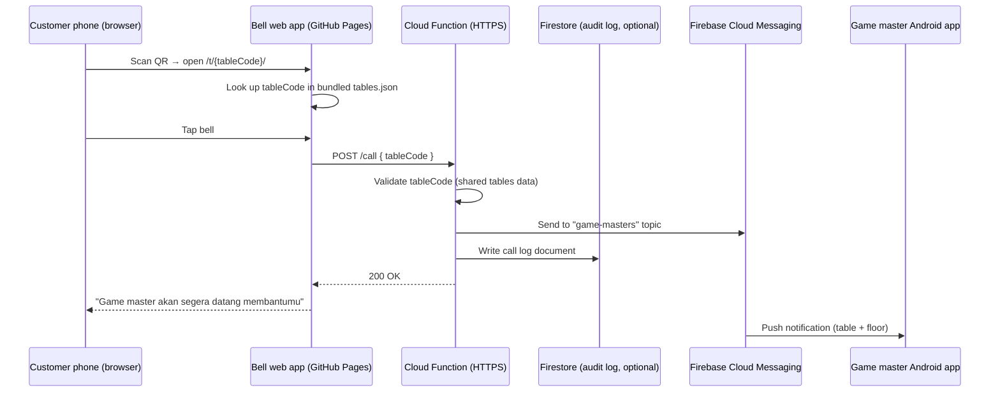

# PRD — Game Master Bell

**Product:** Game Master Bell for Gatherloop Board Game Cafe
**Status:** Draft v1.2 (GitHub Pages hosting; direct HTTPS call to the notify function, Firestore reduced to optional audit log)
**Last updated:** 2026-07-16

---

## 1. Overview

Customers at Gatherloop board game cafe often need help from a game master (rules explanation, game recommendations, dispute resolution). Today they have to physically find one. Game Master Bell lets a customer summon a game master from their table by scanning a QR code and pressing a virtual bell — no app install required on the customer side. Game masters receive a push notification on their phone that includes the table and floor number.

### Goals

- Customers can call a game master in under 10 seconds from scanning the QR code, with zero installation.
- Game masters are notified within seconds, with clear table/floor context.
- The bell interaction feels fun and game-like, matching the cafe's brand.
- **No custom backend to build, host, or maintain** — table data ships as JSON inside the web app, the web app deploys to GitHub Pages, and push delivery is one serverless function + FCM.

### Non-Goals (v1)

- No customer accounts, ordering, or payment features.
- No two-way chat between customer and game master.
- No iOS receiver app (game masters use Android; can be revisited later).
- No analytics dashboard (the Firestore call log is queryable ad-hoc; dashboard is a future iteration).

---

## 2. User Flow

1. Customer sits at a table in Gatherloop board game cafe.
2. Customer scans the QR code sticker on the table using their phone camera.
3. The QR code opens the **Bell web app** in the phone browser, pre-scoped to that table (e.g. `https://gatherloop.github.io/game-master-bell/t/2-05/` → floor 2, table 05).
4. The web app looks up the table code in its bundled `tables.json` and shows an animated bell (PixiJS canvas).
5. Customer taps the bell:
   - The bell plays a ring animation (and optionally a sound).
   - The screen shows the confirmation message: **"Game master akan segera datang membantumu"**.
   - The bell enters a cooldown state to prevent spamming.
6. All on-duty game masters receive a push notification on their Android phone: **"Meja 05 · Lantai 2 memanggil game master"** (table and floor number included).
7. A game master walks to the table and helps the customer.

### Edge Cases

| Case | Behavior |
|---|---|
| Customer taps the bell repeatedly | Client-side cooldown (e.g. 60s): the bell is disabled with a countdown after a successful call. Physical access to the cafe is required to know real table URLs, so abuse risk is low; Firebase App Check can be added later if needed. |
| No network / request fails | Bell shows an error state ("Panggilan gagal, coba lagi") and allows retry immediately. |
| Invalid/unknown table code in URL | Friendly error page asking the customer to re-scan or call staff manually (lookup against bundled `tables.json`; the function re-validates server-side). |
| No game master device subscribed | Call is still sent and logged; the customer still sees the confirmation. Operational alerting is a future concern. |
| Old QR code / renamed table | Table codes are stable identifiers; QR stickers only encode the code, so metadata (floor label, name) can change in `tables.json` without reprinting. |

---

## 3. System Components

Two apps plus one serverless function live in this monorepo:

| Component | Directory | Platform | Purpose |
|---|---|---|---|
| **Bell web app** | `apps/bell-web` | Mobile web, deployed to **GitHub Pages** | Customer-facing bell with game-like animation; bundles `tables.json` with all table/floor data |
| **Notify function** | `functions/` | Firebase Cloud Functions (serverless) | Single HTTPS endpoint that validates the call and sends the FCM push |
| **Receiver app** | `apps/receiver-android` | Android | Game master app that receives and displays push notifications |

### Role of each Firebase service

| Service | Role | Required? |
|---|---|---|
| **FCM** | Delivers the push notification to game master phones (topic `game-masters`) | Yes — the core delivery channel, free and unlimited |
| **Cloud Functions** | One HTTPS endpoint the web app calls on bell tap; holds the server credentials FCM requires and performs the send | Yes — FCM sends need server credentials that must never ship in a public web app |
| **Firestore** | **Optional audit log only.** The function writes one document per call (server-side) so operations can answer "what calls happened last night?". Not in the critical path; can be dropped without affecting the product | Optional |
| **Firebase Hosting** | Not used — the web app is a static bundle deployed to **GitHub Pages** via GitHub Actions | No |

### Architecture



The Android app subscribes to a `game-masters` FCM **topic**, so fan-out to all staff devices is a single topic send — no device-token bookkeeping anywhere.

### GitHub Pages routing note

GitHub Pages only serves static files, so a deep link like `/t/2-05` has no server-side route. Since every valid table code is known at build time from `tables.json`, the build step **generates one static `t/<code>/index.html` per active table**. QR links resolve to real files — no SPA 404 hacks, no hash URLs — and an unknown code naturally lands on the styled 404 page.

---

## 4. Tech Stack

### Bell web app (customer) — required stack + suggestions

| Concern | Choice | Rationale |
|---|---|---|
| UI framework | **React + TypeScript** | Required. |
| Bell rendering/animation | **PixiJS** (via `@pixi/react` or plain Pixi in a ref-managed canvas) | Required. Game-like bell animation, particles, squash-and-stretch on tap. |
| Build tool | **Vite** | Fast dev server, first-class TS/React support, static output for GitHub Pages. |
| Table data | **`tables.json` bundled with the app** | Small, rarely-changing dataset; edited via PR, validated at build time against a schema. |
| Call transport | **`fetch` POST to the notify function's HTTPS URL** | One endpoint, no SDK needed on the client. |
| Styling (non-canvas UI) | **Plain CSS / CSS modules** | The app is essentially one screen; no styling framework needed. |
| Routing | Static per-table pages generated at build time from `tables.json` | Works on GitHub Pages without server-side routing. |
| Hosting | **GitHub Pages** via GitHub Actions deploy workflow | Free, no extra accounts, deploys on merge to `main`. |

### Notify function — suggestion

| Concern | Choice | Rationale |
|---|---|---|
| Runtime | **Firebase Cloud Functions (2nd gen) + TypeScript** | Deployed with `firebase deploy`; no infra to manage. Requires the Blaze plan, but usage stays inside the free quota at cafe scale. |
| Trigger | HTTPS endpoint `POST /call` with CORS allowing the GitHub Pages origin | Matches the mental model: bell tap → function → FCM. No database in the critical path. |
| Validation | Table codes validated against the shared tables data (`packages/shared`) | Same source of truth as the web app; unknown codes get 404. |
| Push | **firebase-admin SDK → FCM topic send** | Official server SDK; single send reaches all subscribed staff devices. |
| Audit | One Firestore document written per call (server-side), including the FCM delivery result | Optional; client has zero Firestore access (rules deny all). |

### Receiver Android app (game master) — suggestion

| Concern | Choice | Rationale |
|---|---|---|
| Language/UI | **Kotlin + Jetpack Compose** | Modern Android default; the app is nearly UI-less (a status screen + notifications). |
| Push | **Firebase Cloud Messaging** (topic subscription) | Reliable delivery incl. background/killed app state; no token registration endpoint needed. |
| Notification | High-priority notification channel with sound + vibration, showing table and floor | Game masters must notice it on a busy floor. |
| Distribution | Direct APK install (sideload) or internal track on Play Store | Only a handful of staff devices. |
| Min SDK | API 26 (Android 8.0) | Notification channels baseline; covers all realistic staff devices. |

---

## 5. Functional Requirements

### 5.1 Bell web app

- **FR-W1** — Each table's QR code encodes the full URL of its generated page (e.g. `/t/2-05/`); the build generates one static page per active table from `tables.json`.
- **FR-W2** — Table metadata (floor, number, display name, active flag) is bundled as `tables.json`; the build fails if the file doesn't match its schema.
- **FR-W3** — The main screen renders an animated bell on a PixiJS canvas: idle animation (subtle sway/glow), tap feedback (ring/shake animation, optional ring sound).
- **FR-W4** — Tapping the bell sends `POST /call` with `{ "tableCode": "2-05" }` to the notify function.
- **FR-W5** — On success, show **"Game master akan segera datang membantumu"** and start a visible client-side cooldown (bell disabled, countdown shown) of 60 seconds.
- **FR-W6** — On failure (offline, non-2xx), show a retry-able error state in Indonesian ("Panggilan gagal, coba lagi").
- **FR-W7** — Unknown table codes land on a friendly, styled 404 page.
- **FR-W8** — The app is mobile-first, loads fast on cafe Wi-Fi/4G (target < 3s to interactive on a mid-range phone), and works on recent Chrome/Safari mobile browsers.
- **FR-W9** — UI copy is in Indonesian.

### 5.2 Notify function

- **FR-F1** — `POST /call` accepts `{ "tableCode": string }`, validates it against the shared tables data (404 for unknown/inactive codes), and rejects malformed bodies (400).
- **FR-F2** — On a valid call, sends one FCM message to the `game-masters` topic with title (e.g. "Panggilan Game Master"), body (e.g. "Meja 05 · Lantai 2 memanggil game master"), and data fields `tableCode`, `floor`, `number`, `calledAt`.
- **FR-F3** — Writes one audit document to Firestore per call (table code, timestamp, FCM delivery result). Firestore security rules deny all client access; only the function (admin SDK) writes.
- **FR-F4** — CORS allows only the GitHub Pages origin (plus localhost for development).

### 5.3 Receiver Android app

- **FR-D1** — On first launch, the app requests notification permission (Android 13+) and subscribes to the `game-masters` FCM topic.
- **FR-D2** — Incoming calls display a high-priority notification with sound and vibration showing table and floor, in foreground, background, and killed states.
- **FR-D3** — The app shows a simple status screen: topic subscription status and a list of recent calls received on this device.
- **FR-D4** — Notification channel is user-visible ("Panggilan Meja") so staff can adjust sound/vibration via system settings.

---

## 6. Non-Functional Requirements

- **NFR-1 Latency** — End-to-end (bell tap → notification on game master phone) under ~5 seconds under normal network conditions (a cold-started function may add 1–2s occasionally).
- **NFR-2 Availability** — GitHub Pages + Firebase managed availability; the bell must fail gracefully when offline.
- **NFR-3 Security** — The web app is public by design (physical QR). Server credentials live only in the function. The function validates table codes and restricts CORS to the app's origin. Client-side cooldown limits accidental spam; Firebase App Check is the escalation path if abuse ever appears.
- **NFR-4 Cost** — FCM is free and unlimited; GitHub Pages is free; function + Firestore usage at one-cafe scale fits Firebase's free quotas (Blaze plan required, expected bill $0, budget alert configured).
- **NFR-5 Maintainability** — Monorepo with shared TypeScript types and table data (`packages/shared`) used by both the web app and the function; CI runs lint, typecheck, and tests on every PR.

---

## 7. Data Model (v1)

### `tables.json` (in `packages/shared`, bundled into the web app and the function)

```jsonc
[
  {
    "code": "2-05",        // stable identifier printed in QR
    "floor": 2,
    "number": "05",
    "displayName": "Meja 05",
    "active": true
  }
]
```

### Firestore `calls` collection (optional audit log, written only by the function)

```
calls/{autoId}
  tableCode   string     -- "2-05"
  floor       number     -- 2
  number      string     -- "05"
  calledAt    timestamp
  fcmResult   string     -- message id / error
```

---

## 8. Repository Layout

```
game-master-bell/
├── docs/
│   └── PRD.md
├── apps/
│   ├── bell-web/            # React + TS + PixiJS (Vite), deployed to GitHub Pages
│   └── receiver-android/    # Kotlin + Jetpack Compose + FCM
├── functions/               # Firebase Cloud Functions (TS): POST /call → FCM
├── packages/
│   └── shared/              # tables.json + shared TS types (API contract, table schema)
├── firebase.json            # Functions + Firestore rules config
├── firestore.rules          # Deny-all (clients never touch Firestore)
└── .github/workflows/       # CI + GitHub Pages deploy
```

Web/function side is a **pnpm workspace**; the Android app lives alongside it as a standard Gradle project (not part of the pnpm workspace).

---

## 9. Implementation Phases

Each phase is scoped to be a **single, small, reviewable PR**. Phases are ordered so every PR leaves `main` in a working, demoable state, and the web and Android tracks can proceed in parallel after Phase 1.

| # | PR | Scope | Demoable outcome |
|---|---|---|---|
| **1** | Monorepo scaffolding & CI | pnpm workspace, TypeScript base config, ESLint/Prettier, `packages/shared` stub, GitHub Actions running lint + typecheck. No app code yet. | CI is green on an empty-but-wired repo. |
| **2** | Bell web app scaffold + `tables.json` | Vite + React + TS app in `apps/bell-web`, `tables.json` in `packages/shared` with schema validation at build time, per-table static page generation, static placeholder bell (no Pixi yet), styled 404 page. | Open `/t/2-05/` locally and see the table's placeholder page; bad codes show the 404 page. |
| **3** | GitHub Pages deploy workflow | Actions workflow building `apps/bell-web` and deploying to GitHub Pages on merge to `main`, correct Vite `base` path. | The placeholder app is live on the public GitHub Pages URL. |
| **4** | PixiJS bell scene | Pixi canvas integration, bell sprite with idle animation and tap animation (no networking). Isolated in a `BellStage` component. | The bell looks and feels game-like on tap. |
| **5** | Notify Cloud Function | `functions/` workspace: HTTPS `POST /call` with validation from shared tables data, FCM topic send, Firestore audit write, deny-all `firestore.rules`, CORS config, emulator-based tests. | `curl` the function (emulator) → topic message visible; unknown codes 404. |
| **6** | Wire bell to function | `fetch` hook calling `POST /call`, success state ("Game master akan segera datang membantumu"), 60s cooldown countdown, error state per FR-W5–W6, function URL via env config. | Full customer flow works end-to-end from the deployed page. |
| **7** | Android app scaffold | Gradle + Kotlin + Compose project in `apps/receiver-android`, single status screen, notification permission request, CI job for `assembleDebug`. No FCM yet. | App installs and shows the status screen. |
| **8** | Android FCM receive | google-services config, `game-masters` topic subscription, `FirebaseMessagingService`, high-priority notification channel with table/floor content. | Bell tap on the web triggers a notification on a real phone — full end-to-end flow. |
| **9** | Recent-calls list on Android | Persist received calls locally (Room or DataStore), show the recent-calls list on the status screen (FR-D3). | Game master can review recent calls. |
| **10** | Polish & ops | Bell sound + haptics-like feedback, loading states, favicon/app icons, QR code generation script (`scripts/generate-qr.ts` producing one QR per active table from `tables.json`), deploy/runbook docs. | Printable QR codes; documented deploys for web (auto) and function (`firebase deploy`). |

**Parallelization note:** after Phase 1, the web track (2→3→4→5→6) and Android track (7) are independent; Phase 8 is the integration point.

---

## 10. Open Questions

1. Should game masters be able to mark themselves **on/off duty** (so off-duty staff don't get pinged)? Deferred — v1 notifies all subscribed devices.
2. Should there be an **acknowledge** action ("I'm on it") so other game masters know a call is taken? Deferred to v2 — requires two-way state and possibly showing status to the customer.
3. Exact **cooldown duration** (60s assumed) — to be validated with cafe operations.
4. Play Store internal track vs. **sideloaded APK** for staff devices — affects Phase 10 docs only.
5. Keep or drop the **Firestore audit log**? Kept for now (one server-side write per call, free at this scale); dropping it removes Firestore entirely.
