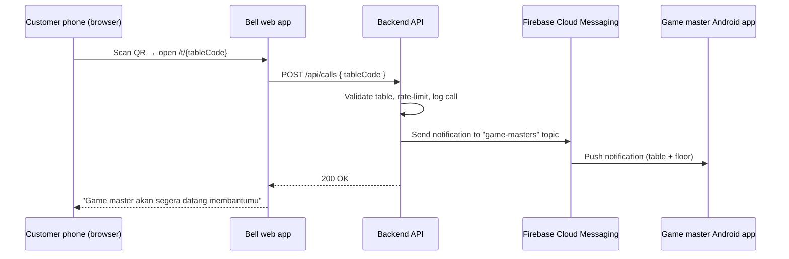

# PRD — Game Master Bell

**Product:** Game Master Bell for Gatherloop Board Game Cafe
**Status:** Draft v1.0
**Last updated:** 2026-07-16

---

## 1. Overview

Customers at Gatherloop board game cafe often need help from a game master (rules explanation, game recommendations, dispute resolution). Today they have to physically find one. Game Master Bell lets a customer summon a game master from their table by scanning a QR code and pressing a virtual bell — no app install required on the customer side. Game masters receive a push notification on their phone that includes the table and floor number.

### Goals

- Customers can call a game master in under 10 seconds from scanning the QR code, with zero installation.
- Game masters are notified within seconds, with clear table/floor context.
- The bell interaction feels fun and game-like, matching the cafe's brand.

### Non-Goals (v1)

- No customer accounts, ordering, or payment features.
- No two-way chat between customer and game master.
- No iOS receiver app (game masters use Android; can be revisited later).
- No analytics dashboard (basic call logs only; dashboard is a future iteration).

---

## 2. User Flow

1. Customer sits at a table in Gatherloop board game cafe.
2. Customer scans the QR code sticker on the table using their phone camera.
3. The QR code opens the **Bell web app** in the phone browser, pre-scoped to that table (e.g. `https://bell.gatherloop.com/t/2-05` → floor 2, table 05).
4. The web app shows an animated bell (PixiJS canvas).
5. Customer taps the bell:
   - The bell plays a ring animation (and optionally a sound).
   - The screen shows the confirmation message: **"Game master akan segera datang membantumu"**.
   - The bell enters a cooldown state to prevent spamming.
6. All on-duty game masters receive a push notification on their Android phone: **"Meja 05 · Lantai 2 memanggil game master"** (table and floor number included).
7. A game master walks to the table and helps the customer.

### Edge Cases

| Case | Behavior |
|---|---|
| Customer taps the bell repeatedly | Client-side cooldown (e.g. 60s) + server-side rate limit per table. Repeated taps during cooldown show remaining wait time, no duplicate notification. |
| No network / request fails | Bell shows an error state ("Panggilan gagal, coba lagi") and allows retry immediately. |
| Invalid/unknown table code in URL | Friendly error page asking the customer to re-scan or call staff manually. |
| No game master device registered | Call is still logged; the API responds success to the customer (staff monitors logs); operational alerting is a future concern. |
| Old QR code / renamed table | Table codes are stable identifiers managed in config; QR stickers only encode the code, so metadata (floor label, name) can change server-side without reprinting. |

---

## 3. System Components

Three deliverables live in this monorepo:

| Component | Directory | Platform | Purpose |
|---|---|---|---|
| **Bell web app** | `apps/bell-web` | Mobile web (browser) | Customer-facing bell with game-like animation |
| **Backend API** | `apps/api` | Server | Receives call requests, rate-limits, fans out push notifications, stores device tokens and call logs |
| **Receiver app** | `apps/receiver-android` | Android | Game master app that registers for and displays push notifications |

### Architecture



Push delivery uses **Firebase Cloud Messaging (FCM)** — the standard, free push channel for Android. The receiver app subscribes to a `game-masters` topic so the backend doesn't need to track individual device tokens for fan-out (tokens are still registered for future per-device features like on-duty toggling).

---

## 4. Tech Stack

### Bell web app (customer) — required stack + suggestions

| Concern | Choice | Rationale |
|---|---|---|
| UI framework | **React + TypeScript** | Required. |
| Bell rendering/animation | **PixiJS** (via `@pixi/react` or plain Pixi in a ref-managed canvas) | Required. Game-like bell animation, particles, squash-and-stretch on tap. |
| Build tool | **Vite** | Fast dev server, first-class TS/React support, trivial static deploy. |
| Styling (non-canvas UI) | **Plain CSS / CSS modules** | The app is essentially one screen; no styling framework needed. |
| Routing | **React Router** (single route `/t/:tableCode`) | Minimal routing need. |
| State/data fetching | **fetch + small custom hook** | One POST endpoint; no need for react-query. |
| Hosting | Static hosting (Vercel/Netlify/Cloudflare Pages) | The app is a static bundle; API lives separately. |

### Backend API — suggestion

| Concern | Choice | Rationale |
|---|---|---|
| Runtime/framework | **Node.js + TypeScript + Hono** (or Express) | Same language as the web app, tiny API surface (2–3 endpoints), Hono runs on Node and edge runtimes alike. |
| Push | **firebase-admin SDK** | Official server SDK for FCM topic sends. |
| Persistence | **SQLite** (via better-sqlite3 or Drizzle) for v1 | Only needs table config, device tokens, and call logs. Zero-ops; can migrate to Postgres later. |
| Table config | Seeded from a checked-in JSON/TS file | Small, rarely-changing dataset; editable via PR. |
| Rate limiting | In-memory per-table cooldown (60s) | Single-instance deploy is fine for one cafe. |
| Hosting | Any small VM / Railway / Fly.io / Cloud Run | Single lightweight service. |

> Alternative considered: going fully serverless with Firebase Cloud Functions + Firestore (no server to run, same FCM ecosystem). The dedicated Node API was chosen for a simpler local dev story and no vendor lock-in beyond FCM itself, but this is swappable if you prefer all-in Firebase.

### Receiver Android app (game master) — suggestion

| Concern | Choice | Rationale |
|---|---|---|
| Language/UI | **Kotlin + Jetpack Compose** | Modern Android default; the app is nearly UI-less (a settings/status screen + notifications). |
| Push | **Firebase Cloud Messaging** | Reliable delivery incl. background/killed app state; topic subscription for fan-out. |
| Notification | High-priority notification channel with sound + vibration, showing table and floor | Game masters must notice it on a busy floor. |
| Distribution | Direct APK install (sideload) or internal track on Play Store | Only a handful of staff devices. |
| Min SDK | API 26 (Android 8.0) | Notification channels baseline; covers all realistic staff devices. |

---

## 5. Functional Requirements

### 5.1 Bell web app

- **FR-W1** — The app is reachable at `/t/{tableCode}` where `tableCode` encodes floor and table (e.g. `2-05`). The QR code on each table encodes this full URL.
- **FR-W2** — The main screen renders an animated bell on a PixiJS canvas: idle animation (subtle sway/glow), tap feedback (ring/shake animation, optional ring sound).
- **FR-W3** — Tapping the bell sends `POST /api/calls` with the table code.
- **FR-W4** — On success, show **"Game master akan segera datang membantumu"** and start a visible cooldown (bell disabled, countdown shown) of 60 seconds.
- **FR-W5** — On failure (network error, 5xx), show a retry-able error state in Indonesian ("Panggilan gagal, coba lagi").
- **FR-W6** — On rate-limit response (429), show the confirmation/cooldown state (the game master is already on the way) rather than an error.
- **FR-W7** — Invalid table codes show a friendly error page.
- **FR-W8** — The app is mobile-first, loads fast on cafe Wi-Fi/4G (target < 3s to interactive on a mid-range phone), and works on recent Chrome/Safari mobile browsers.
- **FR-W9** — UI copy is in Indonesian.

### 5.2 Backend API

- **FR-A1** — `POST /api/calls` — body `{ "tableCode": "2-05" }`. Validates the table exists, enforces per-table cooldown, persists a call log entry, sends an FCM notification to the `game-masters` topic containing table number and floor, returns `201`.
- **FR-A2** — Returns `429` with remaining cooldown seconds when a table calls again within the cooldown window.
- **FR-A3** — Returns `404` for unknown table codes.
- **FR-A4** — `POST /api/devices` — body `{ "fcmToken": "...", "deviceName": "..." }`. Registers/refreshes a game master device token (used for future per-device features; topic subscription handles v1 fan-out).
- **FR-A5** — `GET /api/tables/{tableCode}` — returns table metadata (floor, display name) so the web app can render "Meja 05 · Lantai 2".
- **FR-A6** — Notification payload includes: title (e.g. "Panggilan Game Master"), body (e.g. "Meja 05 · Lantai 2 memanggil game master"), and data fields `tableNumber`, `floor`, `calledAt`.
- **FR-A7** — All calls are persisted (table code, timestamp, notification delivery result) for basic operational auditing.

### 5.3 Receiver Android app

- **FR-D1** — On first launch, the app requests notification permission (Android 13+) and subscribes to the `game-masters` FCM topic.
- **FR-D2** — The app registers its FCM token with the backend (`POST /api/devices`).
- **FR-D3** — Incoming calls display a high-priority notification with sound and vibration showing table and floor, in foreground, background, and killed states.
- **FR-D4** — The app shows a simple status screen: connection/subscription status and a list of recent calls received on this device.
- **FR-D5** — Notification channel is user-visible ("Panggilan Meja") so staff can adjust sound/vibration via system settings.

---

## 6. Non-Functional Requirements

- **NFR-1 Latency** — End-to-end (bell tap → notification on game master phone) under ~5 seconds under normal network conditions.
- **NFR-2 Availability** — Single-instance deployment is acceptable for v1 (one cafe); the bell must fail gracefully when the API is down.
- **NFR-3 Security** — The calls endpoint is unauthenticated by design (public QR) but protected by per-table rate limiting and table-code validation. The devices endpoint is protected by a shared secret header (staff-only app). No customer PII is collected.
- **NFR-4 Cost** — FCM is free; hosting should fit in hobby/small tiers.
- **NFR-5 Maintainability** — Monorepo with shared TypeScript types between web app and API; CI runs lint, typecheck, and tests on every PR.

---

## 7. Data Model (v1)

```
Table
  code        TEXT PK      -- "2-05" (stable identifier printed in QR)
  floor       INTEGER      -- 2
  number      TEXT         -- "05"
  displayName TEXT         -- "Meja 05"
  active      BOOLEAN

Device
  id          INTEGER PK
  fcmToken    TEXT UNIQUE
  deviceName  TEXT
  createdAt   TIMESTAMP
  lastSeenAt  TIMESTAMP

Call
  id          INTEGER PK
  tableCode   TEXT FK -> Table.code
  calledAt    TIMESTAMP
  fcmResult   TEXT         -- delivery result / error for auditing
```

---

## 8. Repository Layout

```
game-master-bell/
├── docs/
│   └── PRD.md
├── apps/
│   ├── bell-web/            # React + TS + PixiJS (Vite)
│   ├── api/                 # Node + TS + Hono + SQLite + firebase-admin
│   └── receiver-android/    # Kotlin + Jetpack Compose + FCM
├── packages/
│   └── shared/              # Shared TS types (API contracts) for bell-web + api
└── .github/workflows/       # CI
```

Web/API side is a **pnpm workspace**; the Android app lives alongside it as a standard Gradle project (not part of the pnpm workspace).

---

## 9. Implementation Phases

Each phase is scoped to be a **single, small, reviewable PR**. Phases are ordered so every PR leaves `main` in a working, demoable state, and web/API/Android tracks can partially proceed in parallel after Phase 1.

| # | PR | Scope | Demoable outcome |
|---|---|---|---|
| **1** | Monorepo scaffolding & CI | pnpm workspace, TypeScript base config, ESLint/Prettier, `packages/shared` stub, GitHub Actions running lint + typecheck. No app code yet. | CI is green on an empty-but-wired repo. |
| **2** | Bell web app scaffold | Vite + React + TS app in `apps/bell-web`, route `/t/:tableCode`, static placeholder bell (plain HTML/CSS, no Pixi yet), invalid-code error page. | Open `/t/2-05` and see a placeholder bell page. |
| **3** | PixiJS bell scene | Pixi canvas integration, bell sprite with idle animation and tap animation (no networking). Isolated in a `BellStage` component. | The bell looks and feels game-like on tap. |
| **4** | API scaffold + table config | Hono app in `apps/api`, SQLite setup, seeded table config, `GET /api/tables/{code}`, shared request/response types in `packages/shared`, unit tests. | `curl` returns table metadata; unknown codes 404. |
| **5** | Call endpoint + rate limiting | `POST /api/calls` with validation, per-table 60s cooldown (429 + retry-after), call logging to SQLite, tests. FCM stubbed behind an interface. | `curl` a call, see it logged; second call within 60s gets 429. |
| **6** | FCM send integration | firebase-admin wiring, real topic send behind the Phase-5 interface, env-based Firebase config, delivery result stored on the call log. | A test FCM console/device receives the topic message. |
| **7** | Wire bell to API | Web app fetch hook calling `POST /api/calls`, success state ("Game master akan segera datang membantumu"), cooldown countdown, error and 429 handling per FR-W4–W6. | Full customer flow works end-to-end against the API. |
| **8** | Android app scaffold | Gradle + Kotlin + Compose project in `apps/receiver-android`, single status screen, notification permission request, CI job for `assembleDebug`. No FCM yet. | App installs and shows the status screen. |
| **9** | Android FCM receive | google-services config, topic subscription, `FirebaseMessagingService`, high-priority notification channel with table/floor content, token registration to `POST /api/devices` (add this endpoint here). | Bell tap on the web triggers a notification on a real phone. |
| **10** | Recent-calls list on Android | Persist received calls locally (Room or DataStore), show the recent-calls list on the status screen (FR-D4). | Game master can review recent calls. |
| **11** | Polish & ops | Bell sound + haptics-like feedback, loading states, favicon/app icons, QR code generation script (`scripts/generate-qr.ts` producing one QR per active table), deployment docs/configs for web + API. | Printable QR codes; documented deploy path. |

**Parallelization note:** after Phase 1, the web track (2→3), API track (4→5→6), and Android track (8) are independent; Phases 7 and 9 are the integration points.

---

## 10. Open Questions

1. Should game masters be able to mark themselves **on/off duty** (so off-duty staff don't get pinged)? Deferred — v1 notifies all subscribed devices.
2. Should there be an **acknowledge** action ("I'm on it") so other game masters know a call is taken? Deferred to v2 — requires two-way state and possibly showing status to the customer.
3. Exact **cooldown duration** (60s assumed) — to be validated with cafe operations.
4. Play Store internal track vs. **sideloaded APK** for staff devices — affects Phase 11 docs only.
