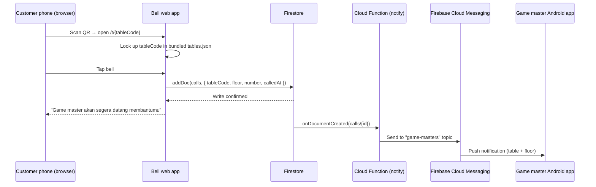

# PRD — Game Master Bell

**Product:** Game Master Bell for Gatherloop Board Game Cafe
**Status:** Draft v1.1 (backend removed in favor of Firebase serverless)
**Last updated:** 2026-07-16

---

## 1. Overview

Customers at Gatherloop board game cafe often need help from a game master (rules explanation, game recommendations, dispute resolution). Today they have to physically find one. Game Master Bell lets a customer summon a game master from their table by scanning a QR code and pressing a virtual bell — no app install required on the customer side. Game masters receive a push notification on their phone that includes the table and floor number.

### Goals

- Customers can call a game master in under 10 seconds from scanning the QR code, with zero installation.
- Game masters are notified within seconds, with clear table/floor context.
- The bell interaction feels fun and game-like, matching the cafe's brand.
- **No custom backend to build, host, or maintain** — table data ships as JSON inside the web app; push delivery runs on Firebase's serverless infrastructure.

### Non-Goals (v1)

- No customer accounts, ordering, or payment features.
- No two-way chat between customer and game master.
- No iOS receiver app (game masters use Android; can be revisited later).
- No analytics dashboard (Firestore call log is queryable ad-hoc; dashboard is a future iteration).

---

## 2. User Flow

1. Customer sits at a table in Gatherloop board game cafe.
2. Customer scans the QR code sticker on the table using their phone camera.
3. The QR code opens the **Bell web app** in the phone browser, pre-scoped to that table (e.g. `https://bell.gatherloop.com/t/2-05` → floor 2, table 05).
4. The web app looks up the table code in its bundled `tables.json` and shows an animated bell (PixiJS canvas).
5. Customer taps the bell:
   - The bell plays a ring animation (and optionally a sound).
   - The screen shows the confirmation message: **"Game master akan segera datang membantumu"**.
   - The bell enters a cooldown state to prevent spamming.
6. All on-duty game masters receive a push notification on their Android phone: **"Meja 05 · Lantai 2 memanggil game master"** (table and floor number included).
7. A game master walks to the table and helps the customer.

### Edge Cases

| Case | Behavior |
|---|---|
| Customer taps the bell repeatedly | Client-side cooldown (e.g. 60s): the bell is disabled with a countdown after a successful call. Physical access to the cafe is required to know real table URLs, so abuse risk is low; Firebase App Check can be added later if needed. |
| No network / request fails | Bell shows an error state ("Panggilan gagal, coba lagi") and allows retry immediately. |
| Invalid/unknown table code in URL | Friendly error page asking the customer to re-scan or call staff manually (lookup against bundled `tables.json`). |
| No game master device subscribed | Call is still written to the log; the customer still sees the confirmation. Operational alerting is a future concern. |
| Old QR code / renamed table | Table codes are stable identifiers; QR stickers only encode the code, so metadata (floor label, name) can change in `tables.json` without reprinting. |

---

## 3. System Components

Two apps plus one serverless function live in this monorepo:

| Component | Directory | Platform | Purpose |
|---|---|---|---|
| **Bell web app** | `apps/bell-web` | Mobile web (browser) | Customer-facing bell with game-like animation; bundles `tables.json` with all table/floor data |
| **Notify function** | `functions/` | Firebase Cloud Functions (serverless) | Single Firestore-triggered function that sends the FCM push when a call is created |
| **Receiver app** | `apps/receiver-android` | Android | Game master app that receives and displays push notifications |

### Why is there still a (tiny, serverless) function?

FCM pushes can only be sent with server credentials — embedding those in a public web app would let anyone send notifications to staff phones. So the web app never sends pushes itself: it writes a call document to Firestore using the Firebase **client** SDK (guarded by security rules), and a ~30-line Cloud Function reacts to the new document and performs the FCM send with server credentials. There is no server to run, no database schema to manage beyond one collection, no API surface, and no hosting bill — `firebase deploy` is the whole ops story.

> Alternative considered: fully client-only, with the Android app holding a foreground service that listens to Firestore directly (no FCM, no function). Rejected because notification delivery would depend on the OS not killing the service — battery optimization on staff phones would silently drop calls. FCM is the only channel that reliably wakes a backgrounded/killed app, and it requires a server-side sender.

### Architecture



The Android app subscribes to a `game-masters` FCM **topic**, so fan-out to all staff devices is a single topic send — no device-token bookkeeping anywhere.

---

## 4. Tech Stack

### Bell web app (customer) — required stack + suggestions

| Concern | Choice | Rationale |
|---|---|---|
| UI framework | **React + TypeScript** | Required. |
| Bell rendering/animation | **PixiJS** (via `@pixi/react` or plain Pixi in a ref-managed canvas) | Required. Game-like bell animation, particles, squash-and-stretch on tap. |
| Build tool | **Vite** | Fast dev server, first-class TS/React support, trivial static deploy. |
| Table data | **`tables.json` bundled with the app** | Small, rarely-changing dataset; edited via PR, validated at build time against a schema. |
| Call transport | **Firebase JS SDK → Firestore `addDoc`** | Client SDK write guarded by security rules; no API server, no CORS. |
| Styling (non-canvas UI) | **Plain CSS / CSS modules** | The app is essentially one screen; no styling framework needed. |
| Routing | **React Router** (single route `/t/:tableCode`) | Minimal routing need. |
| Hosting | **Firebase Hosting** (or Vercel/Netlify/Cloudflare Pages) | Static bundle; Firebase Hosting keeps everything in one console/CLI. |

### Notify function — suggestion

| Concern | Choice | Rationale |
|---|---|---|
| Runtime | **Firebase Cloud Functions (2nd gen) + TypeScript** | Deployed with `firebase deploy`; no infra to manage. |
| Trigger | `onDocumentCreated("calls/{callId}")` | Firestore write is the API; retries and logging come free from the platform. |
| Push | **firebase-admin SDK → FCM topic send** | Official server SDK; single send reaches all subscribed staff devices. |
| Audit | Delivery result written back onto the call document | The `calls` collection doubles as the call log. |

### Receiver Android app (game master) — suggestion

| Concern | Choice | Rationale |
|---|---|---|
| Language/UI | **Kotlin + Jetpack Compose** | Modern Android default; the app is nearly UI-less (a status screen + notifications). |
| Push | **Firebase Cloud Messaging** (topic subscription) | Reliable delivery incl. background/killed app state; no token registration endpoint needed. |
| Notification | High-priority notification channel with sound + vibration, showing table and floor | Game masters must notice it on a busy floor. |
| Distribution | Direct APK install (sideload) or internal track on Play Store | Only a handful of staff devices. |
| Min SDK | API 26 (Android 8.0) | Notification channels baseline; covers all realistic staff devices. |

---

## 5. Functional Requirements

### 5.1 Bell web app

- **FR-W1** — The app is reachable at `/t/{tableCode}` where `tableCode` encodes floor and table (e.g. `2-05`). The QR code on each table encodes this full URL.
- **FR-W2** — Table metadata (floor, number, display name, active flag) is bundled as `tables.json`; the build fails if the file doesn't match its schema.
- **FR-W3** — The main screen renders an animated bell on a PixiJS canvas: idle animation (subtle sway/glow), tap feedback (ring/shake animation, optional ring sound).
- **FR-W4** — Tapping the bell writes a call document to Firestore containing `tableCode`, `floor`, `number`, and a server timestamp.
- **FR-W5** — On successful write, show **"Game master akan segera datang membantumu"** and start a visible client-side cooldown (bell disabled, countdown shown) of 60 seconds.
- **FR-W6** — On failure (offline, rules rejection), show a retry-able error state in Indonesian ("Panggilan gagal, coba lagi").
- **FR-W7** — Invalid table codes (not in `tables.json`, or inactive) show a friendly error page.
- **FR-W8** — The app is mobile-first, loads fast on cafe Wi-Fi/4G (target < 3s to interactive on a mid-range phone), and works on recent Chrome/Safari mobile browsers.
- **FR-W9** — UI copy is in Indonesian.

### 5.2 Firestore & notify function

- **FR-F1** — Security rules on `calls`: `create` only (no read/update/delete from clients), and the document shape is validated in rules (required fields, correct types, `calledAt == request.time`).
- **FR-F2** — `onDocumentCreated(calls/{id})` sends one FCM message to the `game-masters` topic with title (e.g. "Panggilan Game Master"), body (e.g. "Meja 05 · Lantai 2 memanggil game master"), and data fields `tableCode`, `floor`, `number`, `calledAt`.
- **FR-F3** — The function writes the FCM delivery result (message id or error) back onto the call document for auditing; the `calls` collection is the call log.
- **FR-F4** — The function must be idempotent per document (safe under Cloud Functions' at-least-once delivery).

### 5.3 Receiver Android app

- **FR-D1** — On first launch, the app requests notification permission (Android 13+) and subscribes to the `game-masters` FCM topic.
- **FR-D2** — Incoming calls display a high-priority notification with sound and vibration showing table and floor, in foreground, background, and killed states.
- **FR-D3** — The app shows a simple status screen: topic subscription status and a list of recent calls received on this device.
- **FR-D4** — Notification channel is user-visible ("Panggilan Meja") so staff can adjust sound/vibration via system settings.

---

## 6. Non-Functional Requirements

- **NFR-1 Latency** — End-to-end (bell tap → notification on game master phone) under ~5 seconds under normal network conditions.
- **NFR-2 Availability** — Firebase-managed availability; the bell must fail gracefully when offline.
- **NFR-3 Security** — The web app is public by design (physical QR). Firestore rules restrict clients to well-formed `create`s on `calls` only; server credentials never reach the client. Client-side cooldown limits accidental spam; Firebase App Check is the escalation path if abuse ever appears.
- **NFR-4 Cost** — FCM is free; Firestore/Functions/Hosting usage at one-cafe scale fits Firebase's free tier.
- **NFR-5 Maintainability** — Monorepo with shared TypeScript types (call document shape) between web app and function; CI runs lint, typecheck, and tests on every PR.

---

## 7. Data Model (v1)

### `tables.json` (bundled in the web app)

```jsonc
[
  {
    "code": "2-05",        // stable identifier printed in QR
    "floor": 2,
    "number": "05",
    "displayName": "Meja 05",
    "active": true
  }
]
```

### Firestore `calls` collection (created by web app, enriched by function)

```
calls/{autoId}
  tableCode   string     -- "2-05"
  floor       number     -- 2
  number      string     -- "05"
  calledAt    timestamp  -- server timestamp
  fcmResult   string?    -- message id / error, written by the function
```

---

## 8. Repository Layout

```
game-master-bell/
├── docs/
│   └── PRD.md
├── apps/
│   ├── bell-web/            # React + TS + PixiJS (Vite) + tables.json
│   └── receiver-android/    # Kotlin + Jetpack Compose + FCM
├── functions/               # Firebase Cloud Functions (TS): notify-on-call
├── packages/
│   └── shared/              # Shared TS types (call document, table schema)
├── firebase.json            # Hosting + Functions + Firestore rules config
├── firestore.rules
└── .github/workflows/       # CI
```

Web/function side is a **pnpm workspace**; the Android app lives alongside it as a standard Gradle project (not part of the pnpm workspace).

---

## 9. Implementation Phases

Each phase is scoped to be a **single, small, reviewable PR**. Phases are ordered so every PR leaves `main` in a working, demoable state, and the web and Android tracks can proceed in parallel after Phase 1.

| # | PR | Scope | Demoable outcome |
|---|---|---|---|
| **1** | Monorepo scaffolding & CI | pnpm workspace, TypeScript base config, ESLint/Prettier, `packages/shared` stub, GitHub Actions running lint + typecheck. No app code yet. | CI is green on an empty-but-wired repo. |
| **2** | Bell web app scaffold + `tables.json` | Vite + React + TS app in `apps/bell-web`, route `/t/:tableCode`, `tables.json` with schema validation at build time, static placeholder bell (no Pixi yet), invalid-code error page. | Open `/t/2-05` and see the table's placeholder page; bad codes show the error page. |
| **3** | PixiJS bell scene | Pixi canvas integration, bell sprite with idle animation and tap animation (no networking). Isolated in a `BellStage` component. | The bell looks and feels game-like on tap. |
| **4** | Firebase wiring + call write | Firebase project config, Firestore `addDoc` on bell tap, `firestore.rules` (create-only, shape-validated), success/confirmation state, 60s cooldown countdown, error state, tested against the Firestore emulator. | Tapping the bell creates a call document (visible in emulator/console) and shows "Game master akan segera datang membantumu". |
| **5** | Notify Cloud Function | `functions/` workspace: `onDocumentCreated(calls/{id})` → FCM topic send, delivery result written back, idempotency, unit tests with emulator. | A new call document produces a topic message (verified via emulator/FCM console). |
| **6** | Android app scaffold | Gradle + Kotlin + Compose project in `apps/receiver-android`, single status screen, notification permission request, CI job for `assembleDebug`. No FCM yet. | App installs and shows the status screen. |
| **7** | Android FCM receive | google-services config, `game-masters` topic subscription, `FirebaseMessagingService`, high-priority notification channel with table/floor content. | Bell tap on the web triggers a notification on a real phone — full end-to-end flow. |
| **8** | Recent-calls list on Android | Persist received calls locally (Room or DataStore), show the recent-calls list on the status screen (FR-D3). | Game master can review recent calls. |
| **9** | Polish & ops | Bell sound + haptics-like feedback, loading states, favicon/app icons, QR code generation script (`scripts/generate-qr.ts` producing one QR per active table from `tables.json`), Firebase Hosting deploy + docs. | Printable QR codes; documented one-command deploy. |

**Parallelization note:** after Phase 1, the web track (2→3→4→5) and Android track (6) are independent; Phase 7 is the integration point.

---

## 10. Open Questions

1. Should game masters be able to mark themselves **on/off duty** (so off-duty staff don't get pinged)? Deferred — v1 notifies all subscribed devices.
2. Should there be an **acknowledge** action ("I'm on it") so other game masters know a call is taken? Deferred to v2 — requires two-way state and possibly showing status to the customer.
3. Exact **cooldown duration** (60s assumed) — to be validated with cafe operations.
4. Play Store internal track vs. **sideloaded APK** for staff devices — affects Phase 9 docs only.
